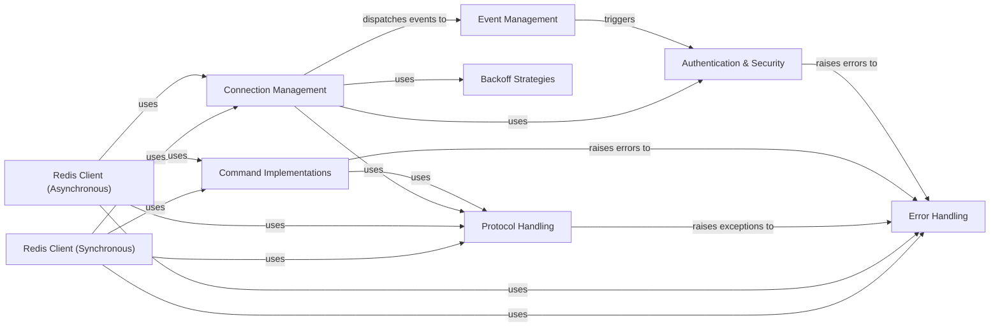

## Details

Analysis of the Client API subsystem in redis-py

### Redis Client (Synchronous)

This component provides the synchronous, blocking interface for interacting with a Redis server. It exposes methods for all standard Redis commands, allowing users to execute operations directly. It also manages synchronous command pipelines and transactions.

**Related Classes/Methods**:

- <a href="https://github.com/redis/redis-py/blob/master/redis/client.py#L111-L667" target="_blank" rel="noopener noreferrer">`redis.client.Redis` (111:667)</a>

- <a href="https://github.com/redis/redis-py/blob/master/redis/client.py#L1278-L1630" target="_blank" rel="noopener noreferrer">`redis.client.Pipeline` (1278:1630)</a>

### Redis Client (Asynchronous)

This component offers the asynchronous, non-blocking interface for interacting with Redis, built on `asyncio`. It mirrors the synchronous client's functionality but is designed for high-concurrency applications, enabling efficient I/O operations without blocking the event loop.

**Related Classes/Methods**:

- <a href="https://github.com/redis/redis-py/blob/master/redis/asyncio/client.py#L108-L714" target="_blank" rel="noopener noreferrer">`redis.asyncio.client.Redis` (108:714)</a>

- <a href="https://github.com/redis/redis-py/blob/master/redis/asyncio/client.py#L1250-L1617" target="_blank" rel="noopener noreferrer">`redis.asyncio.client.Pipeline` (1250:1617)</a>

### Connection Management [[Expand]](./Connection_Management.md)

This component is responsible for establishing, maintaining, and pooling connections to Redis servers. It handles the low-level network communication details, including TCP/IP sockets, SSL/TLS, and Unix domain sockets, ensuring efficient resource utilization and connection stability.

**Related Classes/Methods**:

- <a href="https://github.com/redis/redis-py/blob/master/redis/connection.py#L1308-L1647" target="_blank" rel="noopener noreferrer">`redis.connection.ConnectionPool` (1308:1647)</a>

- <a href="https://github.com/redis/redis-py/blob/master/redis/connection.py#L729-L800" target="_blank" rel="noopener noreferrer">`redis.connection.Connection` (729:800)</a>

- <a href="https://github.com/redis/redis-py/blob/master/redis/asyncio/connection.py#L1030-L1252" target="_blank" rel="noopener noreferrer">`redis.asyncio.connection.ConnectionPool` (1030:1252)</a>

- <a href="https://github.com/redis/redis-py/blob/master/redis/asyncio/connection.py#L722-L776" target="_blank" rel="noopener noreferrer">`redis.asyncio.connection.Connection` (722:776)</a>

### Protocol Handling

This component manages the serialization and deserialization of data according to the Redis Serialization Protocol (RESP). It encodes Python commands into RESP format for transmission to Redis and decodes RESP responses back into Python data types. It supports both RESP2 and RESP3 and can leverage `hiredis` for faster parsing.

**Related Classes/Methods**:

- <a href="https://github.com/redis/redis-py/blob/master/redis/_parsers/base.py#L53-L104" target="_blank" rel="noopener noreferrer">`redis._parsers.base.BaseParser` (53:104)</a>

- <a href="https://github.com/redis/redis-py/blob/master/redis/_parsers/hiredis.py#L40-L183" target="_blank" rel="noopener noreferrer">`redis._parsers.hiredis._HiredisParser` (40:183)</a>

- <a href="https://github.com/redis/redis-py/blob/master/redis/_parsers/resp2.py#L8-L67" target="_blank" rel="noopener noreferrer">`redis._parsers.resp2._RESP2Parser` (8:67)</a>

- <a href="https://github.com/redis/redis-py/blob/master/redis/_parsers/resp3.py#L14-L130" target="_blank" rel="noopener noreferrer">`redis._parsers.resp3._RESP3Parser` (14:130)</a>

### Command Implementations

This component provides the concrete implementations for the vast array of Redis commands. Commands are often organized into mixin classes (e.g., `CoreCommands`, `JSONCommands`, `SearchCommands`) that are then inherited by the main `Redis` client classes, promoting modularity and extensibility.

**Related Classes/Methods**:

- <a href="https://github.com/redis/redis-py/blob/master/redis/commands/core.py#L6642-L6655" target="_blank" rel="noopener noreferrer">`redis.commands.core.CoreCommands` (6642:6655)</a>

- <a href="https://github.com/redis/redis-py/blob/master/redis/commands/core.py#L6658-L6671" target="_blank" rel="noopener noreferrer">`redis.commands.core.AsyncCoreCommands` (6658:6671)</a>

- `redis.commands.json.JSON` (1:1)

- `redis.commands.search.Search` (1:1)

### Error Handling

This component defines a comprehensive hierarchy of custom exception classes specific to Redis operations. It provides a structured and user-friendly way to report various issues, such as connection failures, invalid responses, authentication errors, and cluster-specific problems.

**Related Classes/Methods**:

- <a href="https://github.com/redis/redis-py/blob/master/redis/exceptions.py#L3-L4" target="_blank" rel="noopener noreferrer">`redis.exceptions.RedisError` (3:4)</a>

- <a href="https://github.com/redis/redis-py/blob/master/redis/exceptions.py#L7-L8" target="_blank" rel="noopener noreferrer">`redis.exceptions.ConnectionError` (7:8)</a>

- <a href="https://github.com/redis/redis-py/blob/master/redis/exceptions.py#L31-L32" target="_blank" rel="noopener noreferrer">`redis.exceptions.ResponseError` (31:32)</a>

### Authentication & Security

This component manages authentication credentials and secure communication settings. It handles mechanisms like password-based authentication, token-based authentication (e.g., JWT), and SSL/TLS configurations to ensure secure connections to Redis servers.

**Related Classes/Methods**:

- <a href="https://github.com/redis/redis-py/blob/master/redis/auth/token.py#L6-L29" target="_blank" rel="noopener noreferrer">`redis.auth.token.TokenInterface` (6:29)</a>

- <a href="https://github.com/redis/redis-py/blob/master/redis/credentials.py#L7-L20" target="_blank" rel="noopener noreferrer">`redis.credentials.CredentialProvider` (7:20)</a>

### Backoff Strategies

This component provides various algorithms for implementing retry logic with exponential backoff and jitter. It helps in gracefully handling transient network issues or temporary server unavailability by retrying failed operations with increasing delays, preventing overwhelming the server.

**Related Classes/Methods**:

- <a href="https://github.com/redis/redis-py/blob/master/redis/backoff.py#L9-L23" target="_blank" rel="noopener noreferrer">`redis.backoff.AbstractBackoff` (9:23)</a>

- <a href="https://github.com/redis/redis-py/blob/master/redis/backoff.py#L53-L74" target="_blank" rel="noopener noreferrer">`redis.backoff.ExponentialBackoff` (53:74)</a>

### Event Management

This component provides a mechanism for dispatching and listening to internal events within the client library. It allows for custom logic to be triggered at specific points in the client's lifecycle, such as after a connection is released or during re-authentication, enabling extensibility and observability.

**Related Classes/Methods**:

- <a href="https://github.com/redis/redis-py/blob/master/redis/event.py#L56-L89" target="_blank" rel="noopener noreferrer">`redis.event.EventDispatcher` (56:89)</a>

- <a href="https://github.com/redis/redis-py/blob/master/redis/event.py#L10-L17" target="_blank" rel="noopener noreferrer">`redis.event.EventListenerInterface` (10:17)</a>

### [FAQ](https://github.com/CodeBoarding/GeneratedOnBoardings/tree/main?tab=readme-ov-file#faq)