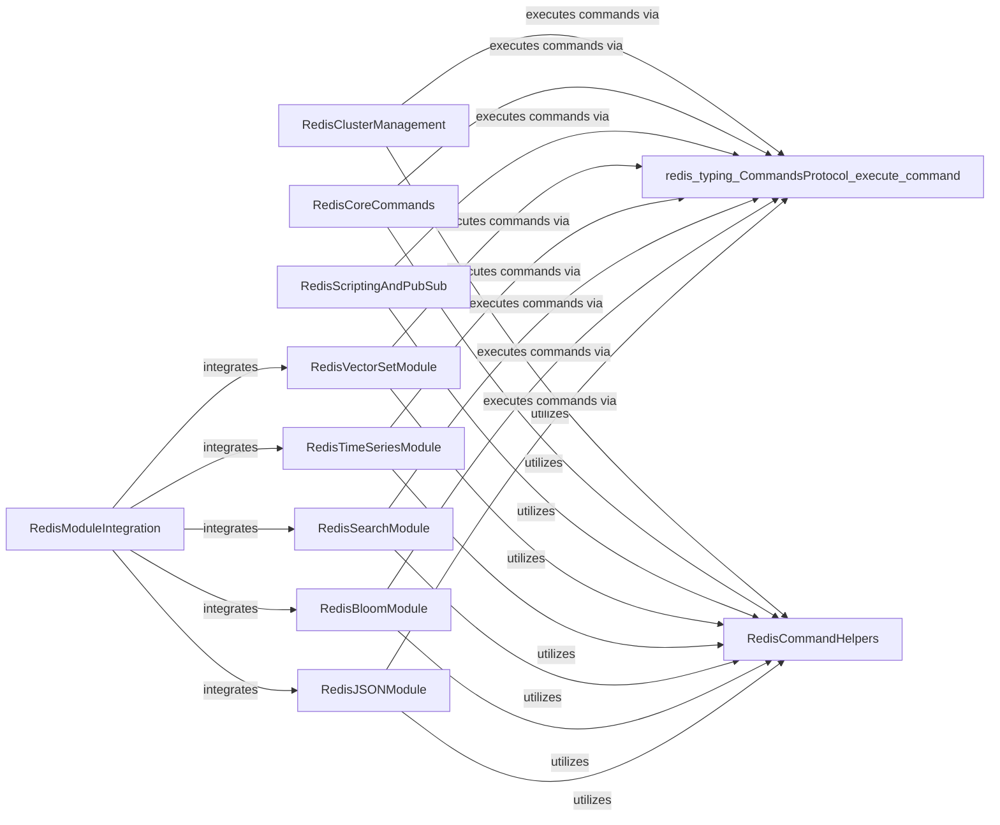

## Component Details

This component overview describes the structure, flow, and purpose of the Command & Module Execution subsystem within the Redis client library. It focuses on how standard Redis commands are implemented and executed, and how interactions with various Redis Modules (e.g., JSON, Search, TimeSeries) are facilitated. The system provides a comprehensive interface for both core Redis functionalities and extended module capabilities, ensuring efficient data operations and server management.

### RedisCoreCommands
This component provides the fundamental Redis commands for interacting with various data structures (strings, lists, sets, sorted sets, hashes, streams, geo-spatial) and handles administrative and management commands for the Redis server (configuration, client management, server-wide operations, ACL, modules, cluster commands). It serves as the primary interface for basic Redis operations.

**Related Classes/Methods**:

- `redis.commands.core.ACLCommands` (full file reference)
- `redis.commands.core.ManagementCommands` (full file reference)
- `redis.commands.core.AsyncManagementCommands` (full file reference)
- `redis.commands.core.BitFieldOperation` (full file reference)
- `redis.commands.core.BasicKeyCommands` (full file reference)
- `redis.commands.core.AsyncBasicKeyCommands` (full file reference)
- `redis.commands.core.ListCommands` (full file reference)
- `redis.commands.core.ScanCommands` (full file reference)
- `redis.commands.core.AsyncScanCommands` (full file reference)
- `redis.commands.core.SetCommands` (full file reference)
- `redis.commands.core.StreamCommands` (full file reference)
- `redis.commands.core.SortedSetCommands` (full file reference)
- `redis.commands.core.HyperlogCommands` (full file reference)
- `redis.commands.core.HashCommands` (full file reference)
- `redis.commands.core.GeoCommands` (full file reference)
- `redis.commands.core.ModuleCommands` (full file reference)
- `redis.commands.core.AsyncModuleCommands` (full file reference)
- `redis.commands.core.ClusterCommands` (full file reference)

### RedisModuleIntegration
This component acts as an integration layer for various Redis modules, providing a unified interface to access their functionalities. It serves as a central point for dispatching commands to specific module clients.

**Related Classes/Methods**:

- <a href="https://github.com/redis/redis-py/blob/master/redis/commands/redismodules.py#L14-L91" target="_blank" rel="noopener noreferrer">`redis.commands.redismodules.RedisModuleCommands` (14:91)</a>
- <a href="https://github.com/redis/redis-py/blob/master/redis/commands/redismodules.py#L94-L101" target="_blank" rel="noopener noreferrer">`redis.commands.redismodules.AsyncRedisModuleCommands` (94:101)</a>

### RedisJSONModule
This component offers a client for the RedisJSON module, allowing for efficient storage and manipulation of JSON documents within Redis. It provides methods for JSON-specific operations like setting, getting, and manipulating JSON paths.

**Related Classes/Methods**:

- <a href="https://github.com/redis/redis-py/blob/master/redis/commands/json/commands.py#L13-L431" target="_blank" rel="noopener noreferrer">`redis.commands.json.commands.JSONCommands` (13:431)</a>
- `redis.commands.json.JSON` (full file reference)

### RedisSearchModule
This component provides a comprehensive client for the Redis Search module, supporting index creation, document management, complex query building, and aggregation. It enables full-text search capabilities within Redis.

**Related Classes/Methods**:

- <a href="https://github.com/redis/redis-py/blob/master/redis/commands/search/index_definition.py#L11-L79" target="_blank" rel="noopener noreferrer">`redis.commands.search.index_definition.IndexDefinition` (11:79)</a>
- <a href="https://github.com/redis/redis-py/blob/master/redis/commands/search/aggregation.py#L89-L372" target="_blank" rel="noopener noreferrer">`redis.commands.search.aggregation.AggregateRequest` (89:372)</a>
- <a href="https://github.com/redis/redis-py/blob/master/redis/commands/search/field.py#L79-L109" target="_blank" rel="noopener noreferrer">`redis.commands.search.field.TextField` (79:109)</a>
- <a href="https://github.com/redis/redis-py/blob/master/redis/commands/search/field.py#L112-L118" target="_blank" rel="noopener noreferrer">`redis.commands.search.field.NumericField` (112:118)</a>
- <a href="https://github.com/redis/redis-py/blob/master/redis/commands/search/field.py#L121-L133" target="_blank" rel="noopener noreferrer">`redis.commands.search.field.GeoShapeField` (121:133)</a>
- <a href="https://github.com/redis/redis-py/blob/master/redis/commands/search/field.py#L136-L142" target="_blank" rel="noopener noreferrer">`redis.commands.search.field.GeoField` (136:142)</a>
- <a href="https://github.com/redis/redis-py/blob/master/redis/commands/search/field.py#L145-L168" target="_blank" rel="noopener noreferrer">`redis.commands.search.field.TagField` (145:168)</a>
- <a href="https://github.com/redis/redis-py/blob/master/redis/commands/search/field.py#L171-L210" target="_blank" rel="noopener noreferrer">`redis.commands.search.field.VectorField` (171:210)</a>
- `redis.commands.search.commands.SearchCommands` (full file reference)
- `redis.commands.search.commands.AsyncSearchCommands` (full file reference)
- <a href="https://github.com/redis/redis-py/blob/master/redis/commands/search/query.py#L6-L339" target="_blank" rel="noopener noreferrer">`redis.commands.search.query.Query` (6:339)</a>
- <a href="https://github.com/redis/redis-py/blob/master/redis/commands/search/query.py#L347-L364" target="_blank" rel="noopener noreferrer">`redis.commands.search.query.NumericFilter` (347:364)</a>
- <a href="https://github.com/redis/redis-py/blob/master/redis/commands/search/query.py#L367-L376" target="_blank" rel="noopener noreferrer">`redis.commands.search.query.GeoFilter` (367:376)</a>
- <a href="https://github.com/redis/redis-py/blob/master/redis/commands/search/querystring.py#L316-L317" target="_blank" rel="noopener noreferrer">`redis.commands.search.querystring` (316:317)</a>
- `redis.commands.search.reducers` (full file reference)
- <a href="https://github.com/redis/redis-py/blob/master/redis/commands/search/suggestion.py#L6-L20" target="_blank" rel="noopener noreferrer">`redis.commands.search.suggestion.Suggestion` (6:20)</a>
- <a href="https://github.com/redis/redis-py/blob/master/redis/commands/search/suggestion.py#L23-L55" target="_blank" rel="noopener noreferrer">`redis.commands.search.suggestion.SuggestionParser` (23:55)</a>
- <a href="https://github.com/redis/redis-py/blob/master/redis/commands/search/result.py#L7-L87" target="_blank" rel="noopener noreferrer">`redis.commands.search.result.Result` (7:87)</a>
- `redis.commands.search.Search` (full file reference)
- `redis.commands.search.AsyncSearch` (full file reference)

### RedisTimeSeriesModule
This component offers a client for the Redis TimeSeries module, allowing for the creation, manipulation, and querying of time-series data. It provides functionalities for adding samples, querying ranges, and managing time-series data.

**Related Classes/Methods**:

- <a href="https://github.com/redis/redis-py/blob/master/redis/commands/timeseries/info.py#L5-L91" target="_blank" rel="noopener noreferrer">`redis.commands.timeseries.info.TSInfo` (5:91)</a>
- <a href="https://github.com/redis/redis-py/blob/master/redis/commands/timeseries/commands.py#L25-L1000" target="_blank" rel="noopener noreferrer">`redis.commands.timeseries.commands.TimeSeriesCommands` (25:1000)</a>
- `redis.commands.timeseries.TimeSeries` (full file reference)

### RedisBloomModule
This component provides client-side access to the RedisBloom module, enabling the use of probabilistic data structures like Bloom filters, Cuckoo filters, Count-Min sketches, and TopK. It offers methods for interacting with these specialized data structures.

**Related Classes/Methods**:

- <a href="https://github.com/redis/redis-py/blob/master/redis/commands/bf/info.py#L4-L26" target="_blank" rel="noopener noreferrer">`redis.commands.bf.info.BFInfo` (4:26)</a>
- <a href="https://github.com/redis/redis-py/blob/master/redis/commands/bf/info.py#L29-L57" target="_blank" rel="noopener noreferrer">`redis.commands.bf.info.CFInfo` (29:57)</a>
- <a href="https://github.com/redis/redis-py/blob/master/redis/commands/bf/info.py#L92-L120" target="_blank" rel="noopener noreferrer">`redis.commands.bf.info.TDigestInfo` (92:120)</a>
- <a href="https://github.com/redis/redis-py/blob/master/redis/commands/bf/commands.py#L292-L356" target="_blank" rel="noopener noreferrer">`redis.commands.bf.commands.TOPKCommands` (292:356)</a>
- `redis.commands.bf.CMSBloom` (full file reference)
- `redis.commands.bf.TOPKBloom` (full file reference)
- `redis.commands.bf.CFBloom` (full file reference)
- `redis.commands.bf.TDigestBloom` (full file reference)
- `redis.commands.bf.BFBloom` (full file reference)

### RedisVectorSetModule
This component provides the client-side interface for interacting with the Redis VectorSet module, enabling vector similarity search and related operations. It allows for storing and querying vector data within Redis.

**Related Classes/Methods**:

- <a href="https://github.com/redis/redis-py/blob/master/redis/commands/vectorset/commands.py#L40-L367" target="_blank" rel="noopener noreferrer">`redis.commands.vectorset.commands.VectorSetCommands` (40:367)</a>
- `redis.commands.vectorset.VectorSet` (full file reference)

### RedisClusterManagement
This component is responsible for managing Redis Cluster specific operations, including multi-key commands, node management, and data partitioning across slots. It provides an interface for interacting with a Redis Cluster setup.

**Related Classes/Methods**:

- <a href="https://github.com/redis/redis-py/blob/master/redis/commands/cluster.py#L99-L260" target="_blank" rel="noopener noreferrer">`redis.commands.cluster.ClusterMultiKeyCommands` (99:260)</a>
- <a href="https://github.com/redis/redis-py/blob/master/redis/commands/cluster.py#L263-L339" target="_blank" rel="noopener noreferrer">`redis.commands.cluster.AsyncClusterMultiKeyCommands` (263:339)</a>
- <a href="https://github.com/redis/redis-py/blob/master/redis/commands/cluster.py#L342-L692" target="_blank" rel="noopener noreferrer">`redis.commands.cluster.ClusterManagementCommands` (342:692)</a>
- <a href="https://github.com/redis/redis-py/blob/master/redis/commands/cluster.py#L695-L719" target="_blank" rel="noopener noreferrer">`redis.commands.cluster.AsyncClusterManagementCommands` (695:719)</a>
- <a href="https://github.com/redis/redis-py/blob/master/redis/commands/cluster.py#L722-L810" target="_blank" rel="noopener noreferrer">`redis.commands.cluster.ClusterDataAccessCommands` (722:810)</a>

### RedisScriptingAndPubSub
This component encapsulates functionalities related to Redis scripting (Lua scripts) and Publish/Subscribe messaging. It provides methods for executing scripts, managing script caches, and handling pub/sub operations.

**Related Classes/Methods**:

- `redis.commands.core.Script` (full file reference)
- `redis.commands.core.PubSubCommands` (full file reference)
- `redis.commands.core.ScriptCommands` (full file reference)
- `redis.commands.core.AsyncScriptCommands` (full file reference)
- `redis.commands.core.FunctionCommands` (full file reference)

### RedisCommandHelpers
This component provides various utility functions and helper methods that are commonly used across different Redis command implementations for tasks like argument parsing, data conversion, and protocol version handling. It supports the other command components by offering shared functionalities.

**Related Classes/Methods**:

- `redis.commands.helpers` (full file reference)

### [FAQ](https://github.com/CodeBoarding/GeneratedOnBoardings/tree/main?tab=readme-ov-file#faq)