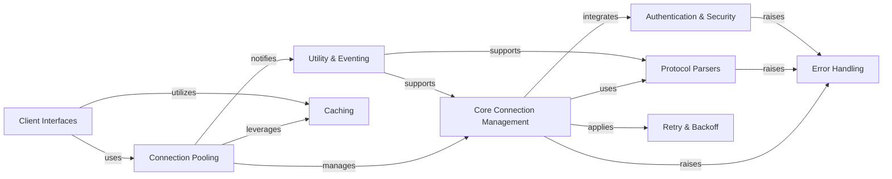

## Component Details

The Connection & Protocol Management subsystem in the Redis client library is a comprehensive system designed to facilitate robust and efficient communication with Redis servers. It manages the entire lifecycle of connections, from establishment and pooling to secure authentication and error handling. The subsystem handles the intricacies of Redis Serialization Protocols (RESP2 and RESP3) for command encoding and response parsing, ensuring data integrity and performance. It also incorporates caching mechanisms, retry strategies for transient failures, and provides high-level client interfaces that abstract the underlying complexities, enabling seamless interaction for users.

### Core Connection Management
This component encapsulates the fundamental logic for establishing, maintaining, and managing connections to Redis servers, including both synchronous and asynchronous implementations. It handles various connection types such as standard TCP, SSL, and Unix domain sockets, and manages the lifecycle of individual connections.

**Related Classes/Methods**:

- `redis.connection.AbstractConnection` (full file reference)
- `redis.connection.Connection` (full file reference)
- `redis.connection.SSLConnection` (full file reference)
- `redis.connection.UnixDomainSocketConnection` (full file reference)
- `redis.connection.CacheProxyConnection` (full file reference)
- <a href="https://github.com/redis/redis-py/blob/master/redis/asyncio/connection.py#L106-L720" target="_blank" rel="noopener noreferrer">`redis.asyncio.connection.AbstractConnection` (106:720)</a>
- <a href="https://github.com/redis/redis-py/blob/master/redis/asyncio/connection.py#L723-L777" target="_blank" rel="noopener noreferrer">`redis.asyncio.connection.Connection` (723:777)</a>
- <a href="https://github.com/redis/redis-py/blob/master/redis/asyncio/connection.py#L780-L844" target="_blank" rel="noopener noreferrer">`redis.asyncio.connection.SSLConnection` (780:844)</a>
- <a href="https://github.com/redis/redis-py/blob/master/redis/asyncio/connection.py#L916-L937" target="_blank" rel="noopener noreferrer">`redis.asyncio.connection.UnixDomainSocketConnection` (916:937)</a>

### Connection Pooling
This component is responsible for efficiently managing a pool of Redis connections. It optimizes resource utilization by reusing existing connections, thereby reducing the overhead of establishing new connections for each operation. It provides mechanisms for acquiring and releasing connections, and supports both blocking and non-blocking behaviors.

**Related Classes/Methods**:

- `redis.connection.ConnectionPool` (full file reference)
- `redis.connection.BlockingConnectionPool` (full file reference)
- `redis.asyncio.connection.ConnectionPool` (full file reference)
- `redis.asyncio.connection.BlockingConnectionPool` (full file reference)

### Protocol Parsers
This component handles the serialization of commands sent to Redis and the deserialization of responses received from the server. It supports different Redis Serialization Protocols (RESP2 and RESP3) and can leverage optimized C implementations like hiredis for improved performance. It also includes logic for parsing command structures and handling socket buffer operations.

**Related Classes/Methods**:

- <a href="https://github.com/redis/redis-py/blob/master/redis/_parsers/encoders.py#L4-L44" target="_blank" rel="noopener noreferrer">`redis._parsers.encoders.Encoder` (4:44)</a>
- <a href="https://github.com/redis/redis-py/blob/master/redis/_parsers/socket.py#L29-L162" target="_blank" rel="noopener noreferrer">`redis._parsers.socket.SocketBuffer` (29:162)</a>
- <a href="https://github.com/redis/redis-py/blob/master/redis/_parsers/commands.py#L10-L53" target="_blank" rel="noopener noreferrer">`redis._parsers.commands.AbstractCommandsParser` (10:53)</a>
- <a href="https://github.com/redis/redis-py/blob/master/redis/_parsers/commands.py#L56-L170" target="_blank" rel="noopener noreferrer">`redis._parsers.commands.CommandsParser` (56:170)</a>
- <a href="https://github.com/redis/redis-py/blob/master/redis/_parsers/commands.py#L173-L281" target="_blank" rel="noopener noreferrer">`redis._parsers.commands.AsyncCommandsParser` (173:281)</a>
- <a href="https://github.com/redis/redis-py/blob/master/redis/_parsers/hiredis.py#L41-L184" target="_blank" rel="noopener noreferrer">`redis._parsers.hiredis._HiredisParser` (41:184)</a>
- <a href="https://github.com/redis/redis-py/blob/master/redis/_parsers/hiredis.py#L187-L295" target="_blank" rel="noopener noreferrer">`redis._parsers.hiredis._AsyncHiredisParser` (187:295)</a>
- <a href="https://github.com/redis/redis-py/blob/master/redis/_parsers/resp3.py#L15-L131" target="_blank" rel="noopener noreferrer">`redis._parsers.resp3._RESP3Parser` (15:131)</a>
- <a href="https://github.com/redis/redis-py/blob/master/redis/_parsers/resp3.py#L134-L257" target="_blank" rel="noopener noreferrer">`redis._parsers.resp3._AsyncRESP3Parser` (134:257)</a>
- <a href="https://github.com/redis/redis-py/blob/master/redis/_parsers/base.py#L54-L105" target="_blank" rel="noopener noreferrer">`redis._parsers.base.BaseParser` (54:105)</a>
- <a href="https://github.com/redis/redis-py/blob/master/redis/_parsers/base.py#L108-L140" target="_blank" rel="noopener noreferrer">`redis._parsers.base._RESPBase` (108:140)</a>
- <a href="https://github.com/redis/redis-py/blob/master/redis/_parsers/base.py#L213-L289" target="_blank" rel="noopener noreferrer">`redis._parsers.base._AsyncRESPBase` (213:289)</a>
- <a href="https://github.com/redis/redis-py/blob/master/redis/_parsers/resp2.py#L9-L68" target="_blank" rel="noopener noreferrer">`redis._parsers.resp2._RESP2Parser` (9:68)</a>
- <a href="https://github.com/redis/redis-py/blob/master/redis/_parsers/resp2.py#L71-L132" target="_blank" rel="noopener noreferrer">`redis._parsers.resp2._AsyncRESP2Parser` (71:132)</a>

### Authentication & Security
This component provides functionalities for authenticating with Redis servers and ensuring secure communication. It includes mechanisms for managing authentication tokens, such as JWT, and implements OCSP (Online Certificate Status Protocol) verification to validate SSL certificates, enhancing the security posture of connections.

**Related Classes/Methods**:

- <a href="https://github.com/redis/redis-py/blob/master/redis/auth/token_manager.py#L121-L340" target="_blank" rel="noopener noreferrer">`redis.auth.token_manager.TokenManager` (121:340)</a>
- <a href="https://github.com/redis/redis-py/blob/master/redis/auth/token.py#L44-L75" target="_blank" rel="noopener noreferrer">`redis.auth.token.SimpleToken` (44:75)</a>
- <a href="https://github.com/redis/redis-py/blob/master/redis/auth/token.py#L78-L130" target="_blank" rel="noopener noreferrer">`redis.auth.token.JWToken` (78:130)</a>
- <a href="https://github.com/redis/redis-py/blob/master/redis/ocsp.py#L22-L47" target="_blank" rel="noopener noreferrer">`redis.ocsp._verify_response` (22:47)</a>
- <a href="https://github.com/redis/redis-py/blob/master/redis/ocsp.py#L50-L106" target="_blank" rel="noopener noreferrer">`redis.ocsp._check_certificate` (50:106)</a>
- <a href="https://github.com/redis/redis-py/blob/master/redis/ocsp.py#L109-L123" target="_blank" rel="noopener noreferrer">`redis.ocsp._get_certificates` (109:123)</a>
- <a href="https://github.com/redis/redis-py/blob/master/redis/ocsp.py#L142-L167" target="_blank" rel="noopener noreferrer">`redis.ocsp.ocsp_staple_verifier` (142:167)</a>
- <a href="https://github.com/redis/redis-py/blob/master/redis/ocsp.py#L170-L308" target="_blank" rel="noopener noreferrer">`redis.ocsp.OCSPVerifier` (170:308)</a>
- <a href="https://github.com/redis/redis-py/blob/master/redis/asyncio/connection.py#L847-L913" target="_blank" rel="noopener noreferrer">`redis.asyncio.connection.RedisSSLContext` (847:913)</a>

### Error Handling
This component defines a comprehensive set of custom exception classes that represent various error conditions encountered during Redis operations, such as connection failures, timeouts, authentication issues, and invalid responses. It centralizes error management, allowing for more specific and robust error handling throughout the library.

**Related Classes/Methods**:

- <a href="https://github.com/redis/redis-py/blob/master/redis/exceptions.py#L36-L37" target="_blank" rel="noopener noreferrer">`redis.exceptions.DataError` (36:37)</a>
- <a href="https://github.com/redis/redis-py/blob/master/redis/exceptions.py#L8-L9" target="_blank" rel="noopener noreferrer">`redis.exceptions.ConnectionError` (8:9)</a>
- <a href="https://github.com/redis/redis-py/blob/master/redis/exceptions.py#L12-L13" target="_blank" rel="noopener noreferrer">`redis.exceptions.TimeoutError` (12:13)</a>
- <a href="https://github.com/redis/redis-py/blob/master/redis/exceptions.py#L16-L17" target="_blank" rel="noopener noreferrer">`redis.exceptions.AuthenticationError` (16:17)</a>
- <a href="https://github.com/redis/redis-py/blob/master/redis/exceptions.py#L4-L5" target="_blank" rel="noopener noreferrer">`redis.exceptions.RedisError` (4:5)</a>
- <a href="https://github.com/redis/redis-py/blob/master/redis/exceptions.py#L28-L29" target="_blank" rel="noopener noreferrer">`redis.exceptions.InvalidResponse` (28:29)</a>
- <a href="https://github.com/redis/redis-py/blob/master/redis/exceptions.py#L32-L33" target="_blank" rel="noopener noreferrer">`redis.exceptions.ResponseError` (32:33)</a>
- <a href="https://github.com/redis/redis-py/blob/master/redis/auth/err.py#L25-L31" target="_blank" rel="noopener noreferrer">`redis.auth.err.TokenRenewalErr` (25:31)</a>
- <a href="https://github.com/redis/redis-py/blob/master/redis/auth/err.py#L13-L22" target="_blank" rel="noopener noreferrer">`redis.auth.err.InvalidTokenSchemaErr` (13:22)</a>
- <a href="https://github.com/redis/redis-py/blob/master/redis/exceptions.py#L20-L21" target="_blank" rel="noopener noreferrer">`redis.exceptions.AuthorizationError` (20:21)</a>

### Client Interfaces
This component provides the high-level API for users to interact with Redis. It includes the standard Redis client, as well as specialized clients for Redis Cluster and Redis Sentinel, abstracting the underlying connection and protocol details to offer a user-friendly interface for executing Redis commands.

**Related Classes/Methods**:

- <a href="https://github.com/redis/redis-py/blob/master/redis/cluster.py#L456-L1000" target="_blank" rel="noopener noreferrer">`redis.cluster.RedisCluster` (456:1000)</a>
- `redis.cluster.NodesManager` (full file reference)
- <a href="https://github.com/redis/redis-py/blob/master/redis/sentinel.py#L137-L195" target="_blank" rel="noopener noreferrer">`redis.sentinel.SentinelConnectionPool` (137:195)</a>
- <a href="https://github.com/redis/redis-py/blob/master/redis/client.py#L112-L670" target="_blank" rel="noopener noreferrer">`redis.client.Redis` (112:670)</a>

### Utility & Eventing
This component comprises a collection of general-purpose utility functions that support various operations across the library, such as string manipulation, version comparison, and argument deprecation handling. It also includes an event dispatching mechanism that allows different parts of the system to communicate and react to specific events, like connection releases.

**Related Classes/Methods**:

- <a href="https://github.com/redis/redis-py/blob/master/redis/utils.py#L211-L216" target="_blank" rel="noopener noreferrer">`redis.utils.get_lib_version` (211:216)</a>
- <a href="https://github.com/redis/redis-py/blob/master/redis/utils.py#L219-L228" target="_blank" rel="noopener noreferrer">`redis.utils.format_error_message` (219:228)</a>
- <a href="https://github.com/redis/redis-py/blob/master/redis/utils.py#L60-L63" target="_blank" rel="noopener noreferrer">`redis.utils.str_if_bytes` (60:63)</a>
- <a href="https://github.com/redis/redis-py/blob/master/redis/utils.py#L153-L195" target="_blank" rel="noopener noreferrer">`redis.utils.deprecated_args` (153:195)</a>
- <a href="https://github.com/redis/redis-py/blob/master/redis/utils.py#L261-L267" target="_blank" rel="noopener noreferrer">`redis.utils.ensure_string` (261:267)</a>
- <a href="https://github.com/redis/redis-py/blob/master/redis/utils.py#L231-L258" target="_blank" rel="noopener noreferrer">`redis.utils.compare_versions` (231:258)</a>
- <a href="https://github.com/redis/redis-py/blob/master/redis/event.py#L57-L90" target="_blank" rel="noopener noreferrer">`redis.event.EventDispatcher` (57:90)</a>
- <a href="https://github.com/redis/redis-py/blob/master/redis/event.py#L93-L103" target="_blank" rel="noopener noreferrer">`redis.event.AfterConnectionReleasedEvent` (93:103)</a>
- <a href="https://github.com/redis/redis-py/blob/master/redis/event.py#L106-L107" target="_blank" rel="noopener noreferrer">`redis.event.AsyncAfterConnectionReleasedEvent` (106:107)</a>

### Retry & Backoff
This component implements robust strategies for handling transient failures by retrying operations with configurable delays. It includes mechanisms for exponential backoff and allows for the definition of supported error types, ensuring that the client can gracefully recover from temporary network issues or server unavailability.

**Related Classes/Methods**:

- <a href="https://github.com/redis/redis-py/blob/master/redis/retry.py#L13-L95" target="_blank" rel="noopener noreferrer">`redis.retry.Retry` (13:95)</a>
- <a href="https://github.com/redis/redis-py/blob/master/redis/backoff.py#L47-L51" target="_blank" rel="noopener noreferrer">`redis.backoff.NoBackoff` (47:51)</a>
- <a href="https://github.com/redis/redis-py/blob/master/redis/asyncio/retry.py#L13-L79" target="_blank" rel="noopener noreferrer">`redis.asyncio.retry.Retry` (13:79)</a>

### Caching
This component provides an internal caching mechanism used to store and retrieve frequently accessed data, such as command information or connection details, to improve performance. It includes different caching policies, like LRU, and a factory for creating cache instances.

**Related Classes/Methods**:

- <a href="https://github.com/redis/redis-py/blob/master/redis/cache.py#L142-L224" target="_blank" rel="noopener noreferrer">`redis.cache.DefaultCache` (142:224)</a>
- <a href="https://github.com/redis/redis-py/blob/master/redis/cache.py#L227-L271" target="_blank" rel="noopener noreferrer">`redis.cache.LRUPolicy` (227:271)</a>
- <a href="https://github.com/redis/redis-py/blob/master/redis/cache.py#L392-L401" target="_blank" rel="noopener noreferrer">`redis.cache.CacheFactory` (392:401)</a>
- <a href="https://github.com/redis/redis-py/blob/master/redis/cache.py#L278-L383" target="_blank" rel="noopener noreferrer">`redis.cache.CacheConfig` (278:383)</a>
- <a href="https://github.com/redis/redis-py/blob/master/redis/cache.py#L19-L21" target="_blank" rel="noopener noreferrer">`redis.cache.CacheKey` (19:21)</a>
- <a href="https://github.com/redis/redis-py/blob/master/redis/cache.py#L24-L43" target="_blank" rel="noopener noreferrer">`redis.cache.CacheEntry` (24:43)</a>

### [FAQ](https://github.com/CodeBoarding/GeneratedOnBoardings/tree/main?tab=readme-ov-file#faq)