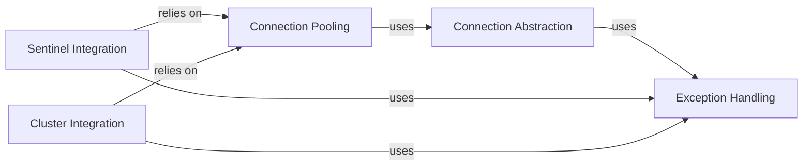

## Details

The Connection Management subsystem in redis-py is crucial for establishing and maintaining connections to various Redis deployments. It abstracts the complexities of network communication, connection pooling, and handling different Redis topologies (standalone, Sentinel, Cluster).

### Connection Abstraction

This component provides the foundational classes for managing individual connections to a Redis server. It handles the low-level details of establishing TCP or Unix socket connections, sending commands, and receiving responses. It also includes support for SSL/TLS connections.

**Related Classes/Methods**:

- <a href="https://github.com/redis/redis-py/blob/master/redis/connection.py#L729-L800" target="_blank" rel="noopener noreferrer">`redis.connection.Connection` (729:800)</a>

- <a href="https://github.com/redis/redis-py/blob/master/redis/connection.py#L1017-L1185" target="_blank" rel="noopener noreferrer">`redis.connection.SSLConnection` (1017:1185)</a>

- <a href="https://github.com/redis/redis-py/blob/master/redis/connection.py#L1188-L1220" target="_blank" rel="noopener noreferrer">`redis.connection.UnixDomainSocketConnection` (1188:1220)</a>

- <a href="https://github.com/redis/redis-py/blob/master/redis/asyncio/connection.py#L722-L776" target="_blank" rel="noopener noreferrer">`redis.asyncio.connection.Connection` (722:776)</a>

- <a href="https://github.com/redis/redis-py/blob/master/redis/asyncio/connection.py#L779-L843" target="_blank" rel="noopener noreferrer">`redis.asyncio.connection.SSLConnection` (779:843)</a>

- <a href="https://github.com/redis/redis-py/blob/master/redis/asyncio/connection.py#L915-L936" target="_blank" rel="noopener noreferrer">`redis.asyncio.connection.UnixDomainSocketConnection` (915:936)</a>

### Connection Pooling

This component manages a pool of connections to Redis, improving performance by reusing existing connections instead of establishing new ones for each operation. It handles connection lifecycle, including creation, release, and optional blocking behavior when the pool is exhausted.

**Related Classes/Methods**:

- <a href="https://github.com/redis/redis-py/blob/master/redis/connection.py#L1308-L1647" target="_blank" rel="noopener noreferrer">`redis.connection.ConnectionPool` (1308:1647)</a>

- <a href="https://github.com/redis/redis-py/blob/master/redis/connection.py#L1650-L1817" target="_blank" rel="noopener noreferrer">`redis.connection.BlockingConnectionPool` (1650:1817)</a>

- <a href="https://github.com/redis/redis-py/blob/master/redis/asyncio/connection.py#L1030-L1252" target="_blank" rel="noopener noreferrer">`redis.asyncio.connection.ConnectionPool` (1030:1252)</a>

- <a href="https://github.com/redis/redis-py/blob/master/redis/asyncio/connection.py#L1255-L1332" target="_blank" rel="noopener noreferrer">`redis.asyncio.connection.BlockingConnectionPool` (1255:1332)</a>

### Sentinel Integration

This component provides support for connecting to and managing Redis Sentinel deployments. It enables the client to discover the current master and replica nodes, handle failovers, and automatically re-route commands to the correct master.

**Related Classes/Methods**:

- <a href="https://github.com/redis/redis-py/blob/master/redis/sentinel.py#L197-L420" target="_blank" rel="noopener noreferrer">`redis.sentinel.Sentinel` (197:420)</a>

- <a href="https://github.com/redis/redis-py/blob/master/redis/sentinel.py#L136-L194" target="_blank" rel="noopener noreferrer">`redis.sentinel.SentinelConnectionPool` (136:194)</a>

- <a href="https://github.com/redis/redis-py/blob/master/redis/sentinel.py#L19-L81" target="_blank" rel="noopener noreferrer">`redis.sentinel.SentinelManagedConnection` (19:81)</a>

- <a href="https://github.com/redis/redis-py/blob/master/redis/asyncio/sentinel.py#L166-L400" target="_blank" rel="noopener noreferrer">`redis.asyncio.sentinel.Sentinel` (166:400)</a>

- <a href="https://github.com/redis/redis-py/blob/master/redis/asyncio/sentinel.py#L95-L163" target="_blank" rel="noopener noreferrer">`redis.asyncio.sentinel.SentinelConnectionPool` (95:163)</a>

- <a href="https://github.com/redis/redis-py/blob/master/redis/asyncio/sentinel.py#L25-L88" target="_blank" rel="noopener noreferrer">`redis.asyncio.sentinel.SentinelManagedConnection` (25:88)</a>

### Cluster Integration

This component handles connections and command routing within a Redis Cluster environment. It manages slot mapping, handles redirection errors (MOVED/ASK), and discovers cluster nodes, ensuring commands are sent to the appropriate shard.

**Related Classes/Methods**:

- <a href="https://github.com/redis/redis-py/blob/master/redis/cluster.py#L455-L1358" target="_blank" rel="noopener noreferrer">`redis.cluster.RedisCluster` (455:1358)</a>

- <a href="https://github.com/redis/redis-py/blob/master/redis/cluster.py#L1441-L1861" target="_blank" rel="noopener noreferrer">`redis.cluster.NodesManager` (1441:1861)</a>

- <a href="https://github.com/redis/redis-py/blob/master/redis/asyncio/cluster.py#L98-L988" target="_blank" rel="noopener noreferrer">`redis.asyncio.cluster.RedisCluster` (98:988)</a>

- <a href="https://github.com/redis/redis-py/blob/master/redis/asyncio/cluster.py#L1210-L1517" target="_blank" rel="noopener noreferrer">`redis.asyncio.cluster.NodesManager` (1210:1517)</a>

### Exception Handling

This component defines a hierarchy of custom exceptions specific to Redis operations and connection issues. It provides a structured way to handle errors such as connection failures, timeouts, authentication errors, and Redis-specific response errors.

**Related Classes/Methods**:

- <a href="https://github.com/redis/redis-py/blob/master/redis/exceptions.py#L3-L4" target="_blank" rel="noopener noreferrer">`redis.exceptions.RedisError` (3:4)</a>

- <a href="https://github.com/redis/redis-py/blob/master/redis/exceptions.py#L7-L8" target="_blank" rel="noopener noreferrer">`redis.exceptions.ConnectionError` (7:8)</a>

- <a href="https://github.com/redis/redis-py/blob/master/redis/exceptions.py#L11-L12" target="_blank" rel="noopener noreferrer">`redis.exceptions.TimeoutError` (11:12)</a>

- <a href="https://github.com/redis/redis-py/blob/master/redis/exceptions.py#L15-L16" target="_blank" rel="noopener noreferrer">`redis.exceptions.AuthenticationError` (15:16)</a>

- <a href="https://github.com/redis/redis-py/blob/master/redis/exceptions.py#L31-L32" target="_blank" rel="noopener noreferrer">`redis.exceptions.ResponseError` (31:32)</a>

- <a href="https://github.com/redis/redis-py/blob/master/redis/exceptions.py#L119-L125" target="_blank" rel="noopener noreferrer">`redis.exceptions.ClusterError` (119:125)</a>

### [FAQ](https://github.com/CodeBoarding/GeneratedOnBoardings/tree/main?tab=readme-ov-file#faq)