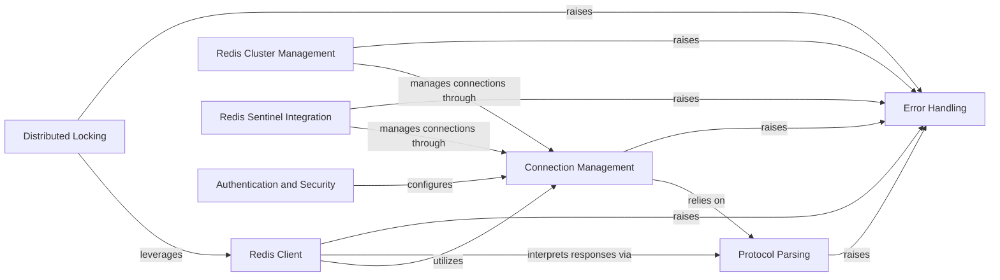

## Component Details

This architecture overview describes the core components of the redis-py library, focusing on how it manages connections, handles Redis commands, interacts with Redis clusters and Sentinels, and provides robust error handling and security features. The main flow involves clients initiating connections through connection management, sending commands which are then parsed and executed, and receiving responses that are processed by the protocol parsing component. Error handling is integrated throughout, providing specific exceptions for various operational failures. Asynchronous capabilities are seamlessly integrated into the core components, offering non-blocking operations for high-performance applications.

### Error Handling

Defines and manages custom exception classes for various Redis-related errors, providing a structured and specific way to handle different error scenarios that can occur during client-server interactions.

**Related Classes/Methods**:

- <a href="https://github.com/redis/redis-py/blob/master/redis/exceptions.py#L4-L5" target="_blank" rel="noopener noreferrer">`redis.exceptions.RedisError` (4:5)</a>

- <a href="https://github.com/redis/redis-py/blob/master/redis/exceptions.py#L8-L9" target="_blank" rel="noopener noreferrer">`redis.exceptions.ConnectionError` (8:9)</a>

- <a href="https://github.com/redis/redis-py/blob/master/redis/exceptions.py#L16-L17" target="_blank" rel="noopener noreferrer">`redis.exceptions.AuthenticationError` (16:17)</a>

- <a href="https://github.com/redis/redis-py/blob/master/redis/exceptions.py#L20-L21" target="_blank" rel="noopener noreferrer">`redis.exceptions.AuthorizationError` (20:21)</a>

- <a href="https://github.com/redis/redis-py/blob/master/redis/exceptions.py#L24-L25" target="_blank" rel="noopener noreferrer">`redis.exceptions.BusyLoadingError` (24:25)</a>

- <a href="https://github.com/redis/redis-py/blob/master/redis/exceptions.py#L223-L223" target="_blank" rel="noopener noreferrer">`redis.exceptions.MaxConnectionsError` (223:223)</a>

- <a href="https://github.com/redis/redis-py/blob/master/redis/exceptions.py#L12-L13" target="_blank" rel="noopener noreferrer">`redis.exceptions.TimeoutError` (12:13)</a>

- <a href="https://github.com/redis/redis-py/blob/master/redis/exceptions.py#L36-L37" target="_blank" rel="noopener noreferrer">`redis.exceptions.DataError` (36:37)</a>

- <a href="https://github.com/redis/redis-py/blob/master/redis/exceptions.py#L40-L41" target="_blank" rel="noopener noreferrer">`redis.exceptions.PubSubError` (40:41)</a>

- <a href="https://github.com/redis/redis-py/blob/master/redis/exceptions.py#L28-L29" target="_blank" rel="noopener noreferrer">`redis.exceptions.InvalidResponse` (28:29)</a>

- <a href="https://github.com/redis/redis-py/blob/master/redis/exceptions.py#L32-L33" target="_blank" rel="noopener noreferrer">`redis.exceptions.ResponseError` (32:33)</a>

- <a href="https://github.com/redis/redis-py/blob/master/redis/exceptions.py#L103-L109" target="_blank" rel="noopener noreferrer">`redis.exceptions.AuthenticationWrongNumberOfArgsError` (103:109)</a>

- <a href="https://github.com/redis/redis-py/blob/master/redis/exceptions.py#L72-L73" target="_blank" rel="noopener noreferrer">`redis.exceptions.NoPermissionError` (72:73)</a>

- <a href="https://github.com/redis/redis-py/blob/master/redis/exceptions.py#L64-L65" target="_blank" rel="noopener noreferrer">`redis.exceptions.ExecAbortError` (64:65)</a>

- <a href="https://github.com/redis/redis-py/blob/master/redis/exceptions.py#L68-L69" target="_blank" rel="noopener noreferrer">`redis.exceptions.ReadOnlyError` (68:69)</a>

- <a href="https://github.com/redis/redis-py/blob/master/redis/exceptions.py#L48-L49" target="_blank" rel="noopener noreferrer">`redis.exceptions.NoScriptError` (48:49)</a>

- <a href="https://github.com/redis/redis-py/blob/master/redis/exceptions.py#L52-L61" target="_blank" rel="noopener noreferrer">`redis.exceptions.OutOfMemoryError` (52:61)</a>

- <a href="https://github.com/redis/redis-py/blob/master/redis/exceptions.py#L76-L77" target="_blank" rel="noopener noreferrer">`redis.exceptions.ModuleError` (76:77)</a>

- <a href="https://github.com/redis/redis-py/blob/master/redis/exceptions.py#L44-L45" target="_blank" rel="noopener noreferrer">`redis.exceptions.WatchError` (44:45)</a>

- <a href="https://github.com/redis/redis-py/blob/master/redis/exceptions.py#L80-L88" target="_blank" rel="noopener noreferrer">`redis.exceptions.LockError` (80:88)</a>

- <a href="https://github.com/redis/redis-py/blob/master/redis/exceptions.py#L91-L94" target="_blank" rel="noopener noreferrer">`redis.exceptions.LockNotOwnedError` (91:94)</a>

- <a href="https://github.com/redis/redis-py/blob/master/redis/exceptions.py#L171-L179" target="_blank" rel="noopener noreferrer">`redis.exceptions.TryAgainError` (171:179)</a>

- <a href="https://github.com/redis/redis-py/blob/master/redis/exceptions.py#L120-L126" target="_blank" rel="noopener noreferrer">`redis.exceptions.ClusterError` (120:126)</a>

- <a href="https://github.com/redis/redis-py/blob/master/redis/exceptions.py#L129-L142" target="_blank" rel="noopener noreferrer">`redis.exceptions.ClusterDownError` (129:142)</a>

- <a href="https://github.com/redis/redis-py/blob/master/redis/exceptions.py#L202-L208" target="_blank" rel="noopener noreferrer">`redis.exceptions.MasterDownError` (202:208)</a>

- <a href="https://github.com/redis/redis-py/blob/master/redis/exceptions.py#L145-L168" target="_blank" rel="noopener noreferrer">`redis.exceptions.AskError` (145:168)</a>

- <a href="https://github.com/redis/redis-py/blob/master/redis/exceptions.py#L192-L199" target="_blank" rel="noopener noreferrer">`redis.exceptions.MovedError` (192:199)</a>

- <a href="https://github.com/redis/redis-py/blob/master/redis/exceptions.py#L182-L189" target="_blank" rel="noopener noreferrer">`redis.exceptions.ClusterCrossSlotError` (182:189)</a>

- <a href="https://github.com/redis/redis-py/blob/master/redis/exceptions.py#L112-L117" target="_blank" rel="noopener noreferrer">`redis.exceptions.RedisClusterException` (112:117)</a>

- <a href="https://github.com/redis/redis-py/blob/master/redis/exceptions.py#L211-L220" target="_blank" rel="noopener noreferrer">`redis.exceptions.SlotNotCoveredError` (211:220)</a>

- <a href="https://github.com/redis/redis-py/blob/master/redis/exceptions.py#L226-L232" target="_blank" rel="noopener noreferrer">`redis.exceptions.CrossSlotTransactionError` (226:232)</a>

- <a href="https://github.com/redis/redis-py/blob/master/redis/exceptions.py#L235-L241" target="_blank" rel="noopener noreferrer">`redis.exceptions.InvalidPipelineStack` (235:241)</a>

### Redis Client

Provides the fundamental synchronous and asynchronous interfaces for interacting with a single Redis instance. It includes functionalities for executing commands, managing Pub/Sub subscriptions, and handling transactional pipelines.

**Related Classes/Methods**:

- <a href="https://github.com/redis/redis-py/blob/master/redis/client.py#L112-L670" target="_blank" rel="noopener noreferrer">`redis.client.Redis` (112:670)</a>

- <a href="https://github.com/redis/redis-py/blob/master/redis/client.py#L676-L740" target="_blank" rel="noopener noreferrer">`redis.client.Monitor` (676:740)</a>

- <a href="https://github.com/redis/redis-py/blob/master/redis/client.py#L743-L1000" target="_blank" rel="noopener noreferrer">`redis.client.PubSub` (743:1000)</a>

- `redis.client.Pipeline` (full file reference)

- `redis.asyncio.client.Redis` (full file reference)

- `redis.asyncio.client.Monitor` (full file reference)

- `redis.asyncio.client.PubSub` (full file reference)

- `redis.asyncio.client.Pipeline` (full file reference)

### Connection Management

Responsible for establishing, maintaining, and pooling synchronous and asynchronous connections to Redis servers. It handles connection health checks, error handling during connection attempts, and SSL/TLS wrapping.

**Related Classes/Methods**:

- `redis.connection.HiredisRespSerializer` (full file reference)

- `redis.connection.AbstractConnection` (full file reference)

- `redis.connection.CacheProxyConnection` (full file reference)

- `redis.connection.SSLConnection` (full file reference)

- `redis.connection.ConnectionPool` (full file reference)

- `redis.connection.BlockingConnectionPool` (full file reference)

- <a href="https://github.com/redis/redis-py/blob/master/redis/asyncio/connection.py#L106-L720" target="_blank" rel="noopener noreferrer">`redis.asyncio.connection.AbstractConnection` (106:720)</a>

- <a href="https://github.com/redis/redis-py/blob/master/redis/asyncio/connection.py#L780-L844" target="_blank" rel="noopener noreferrer">`redis.asyncio.connection.SSLConnection` (780:844)</a>

- <a href="https://github.com/redis/redis-py/blob/master/redis/asyncio/connection.py#L847-L913" target="_blank" rel="noopener noreferrer">`redis.asyncio.connection.RedisSSLContext` (847:913)</a>

- `redis.asyncio.connection.ConnectionPool` (full file reference)

- `redis.asyncio.connection.BlockingConnectionPool` (full file reference)

### Redis Cluster Management

Manages interactions with a Redis Cluster for both synchronous and asynchronous operations. It handles node discovery, slot mapping, command routing, and error handling specific to a clustered environment, including transaction and pipeline strategies within the cluster.

**Related Classes/Methods**:

- <a href="https://github.com/redis/redis-py/blob/master/redis/cluster.py#L456-L1000" target="_blank" rel="noopener noreferrer">`redis.cluster.RedisCluster` (456:1000)</a>

- `redis.cluster.NodesManager` (full file reference)

- `redis.cluster.ClusterPubSub` (full file reference)

- `redis.cluster.AbstractStrategy` (full file reference)

- `redis.cluster.PipelineStrategy` (full file reference)

- `redis.cluster.TransactionStrategy` (full file reference)

- <a href="https://github.com/redis/redis-py/blob/master/redis/commands/cluster.py#L342-L692" target="_blank" rel="noopener noreferrer">`redis.commands.cluster.ClusterManagementCommands` (342:692)</a>

- `redis.asyncio.cluster.RedisCluster` (full file reference)

- `redis.asyncio.cluster.ClusterNode` (full file reference)

- `redis.asyncio.cluster.NodesManager` (full file reference)

- `redis.asyncio.cluster.PipelineStrategy` (full file reference)

- `redis.asyncio.cluster.TransactionStrategy` (full file reference)

### Distributed Locking

Provides mechanisms for implementing distributed locks using Redis, ensuring atomicity and proper release of locks for both synchronous and asynchronous contexts.

**Related Classes/Methods**:

- <a href="https://github.com/redis/redis-py/blob/master/redis/lock.py#L14-L343" target="_blank" rel="noopener noreferrer">`redis.lock.Lock` (14:343)</a>

- <a href="https://github.com/redis/redis-py/blob/master/redis/asyncio/lock.py#L17-L334" target="_blank" rel="noopener noreferrer">`redis.asyncio.lock.Lock` (17:334)</a>

### Redis Sentinel Integration

Facilitates interaction with Redis Sentinel for high availability, allowing clients to discover master and slave nodes and handle failovers for both synchronous and asynchronous operations.

**Related Classes/Methods**:

- <a href="https://github.com/redis/redis-py/blob/master/redis/sentinel.py#L20-L82" target="_blank" rel="noopener noreferrer">`redis.sentinel.SentinelManagedConnection` (20:82)</a>

- <a href="https://github.com/redis/redis-py/blob/master/redis/sentinel.py#L89-L134" target="_blank" rel="noopener noreferrer">`redis.sentinel.SentinelConnectionPoolProxy` (89:134)</a>

- <a href="https://github.com/redis/redis-py/blob/master/redis/sentinel.py#L198-L410" target="_blank" rel="noopener noreferrer">`redis.sentinel.Sentinel` (198:410)</a>

- <a href="https://github.com/redis/redis-py/blob/master/redis/asyncio/sentinel.py#L26-L89" target="_blank" rel="noopener noreferrer">`redis.asyncio.sentinel.SentinelManagedConnection` (26:89)</a>

- <a href="https://github.com/redis/redis-py/blob/master/redis/asyncio/sentinel.py#L96-L164" target="_blank" rel="noopener noreferrer">`redis.asyncio.sentinel.SentinelConnectionPool` (96:164)</a>

- <a href="https://github.com/redis/redis-py/blob/master/redis/asyncio/sentinel.py#L167-L389" target="_blank" rel="noopener noreferrer">`redis.asyncio.sentinel.Sentinel` (167:389)</a>

### Protocol Parsing

Responsible for parsing responses from the Redis server according to the RESP protocol, including handling different RESP versions and error responses for both synchronous and asynchronous contexts.

**Related Classes/Methods**:

- <a href="https://github.com/redis/redis-py/blob/master/redis/_parsers/encoders.py#L4-L44" target="_blank" rel="noopener noreferrer">`redis._parsers.encoders.Encoder` (4:44)</a>

- <a href="https://github.com/redis/redis-py/blob/master/redis/_parsers/socket.py#L29-L162" target="_blank" rel="noopener noreferrer">`redis._parsers.socket.SocketBuffer` (29:162)</a>

- <a href="https://github.com/redis/redis-py/blob/master/redis/_parsers/commands.py#L56-L170" target="_blank" rel="noopener noreferrer">`redis._parsers.commands.CommandsParser` (56:170)</a>

- <a href="https://github.com/redis/redis-py/blob/master/redis/_parsers/commands.py#L173-L281" target="_blank" rel="noopener noreferrer">`redis._parsers.commands.AsyncCommandsParser` (173:281)</a>

- <a href="https://github.com/redis/redis-py/blob/master/redis/_parsers/hiredis.py#L41-L184" target="_blank" rel="noopener noreferrer">`redis._parsers.hiredis._HiredisParser` (41:184)</a>

- <a href="https://github.com/redis/redis-py/blob/master/redis/_parsers/hiredis.py#L187-L295" target="_blank" rel="noopener noreferrer">`redis._parsers.hiredis._AsyncHiredisParser` (187:295)</a>

- <a href="https://github.com/redis/redis-py/blob/master/redis/_parsers/resp3.py#L15-L131" target="_blank" rel="noopener noreferrer">`redis._parsers.resp3._RESP3Parser` (15:131)</a>

- <a href="https://github.com/redis/redis-py/blob/master/redis/_parsers/resp3.py#L134-L257" target="_blank" rel="noopener noreferrer">`redis._parsers.resp3._AsyncRESP3Parser` (134:257)</a>

- <a href="https://github.com/redis/redis-py/blob/master/redis/_parsers/base.py#L54-L105" target="_blank" rel="noopener noreferrer">`redis._parsers.base.BaseParser` (54:105)</a>

- <a href="https://github.com/redis/redis-py/blob/master/redis/_parsers/base.py#L213-L289" target="_blank" rel="noopener noreferrer">`redis._parsers.base._AsyncRESPBase` (213:289)</a>

- <a href="https://github.com/redis/redis-py/blob/master/redis/_parsers/resp2.py#L9-L68" target="_blank" rel="noopener noreferrer">`redis._parsers.resp2._RESP2Parser` (9:68)</a>

- <a href="https://github.com/redis/redis-py/blob/master/redis/_parsers/resp2.py#L71-L132" target="_blank" rel="noopener noreferrer">`redis._parsers.resp2._AsyncRESP2Parser` (71:132)</a>

### Authentication and Security

Handles authentication mechanisms, including token management and OCSP verification for secure connections.

**Related Classes/Methods**:

- <a href="https://github.com/redis/redis-py/blob/master/redis/ocsp.py#L22-L47" target="_blank" rel="noopener noreferrer">`redis.ocsp._verify_response` (22:47)</a>

- <a href="https://github.com/redis/redis-py/blob/master/redis/ocsp.py#L50-L106" target="_blank" rel="noopener noreferrer">`redis.ocsp._check_certificate` (50:106)</a>

- <a href="https://github.com/redis/redis-py/blob/master/redis/ocsp.py#L142-L167" target="_blank" rel="noopener noreferrer">`redis.ocsp.ocsp_staple_verifier` (142:167)</a>

- <a href="https://github.com/redis/redis-py/blob/master/redis/ocsp.py#L170-L308" target="_blank" rel="noopener noreferrer">`redis.ocsp.OCSPVerifier` (170:308)</a>

- <a href="https://github.com/redis/redis-py/blob/master/redis/auth/token_manager.py#L121-L340" target="_blank" rel="noopener noreferrer">`redis.auth.token_manager.TokenManager` (121:340)</a>

- <a href="https://github.com/redis/redis-py/blob/master/redis/auth/token.py#L78-L130" target="_blank" rel="noopener noreferrer">`redis.auth.token.JWToken` (78:130)</a>

### [FAQ](https://github.com/CodeBoarding/GeneratedOnBoardings/tree/main?tab=readme-ov-file#faq)