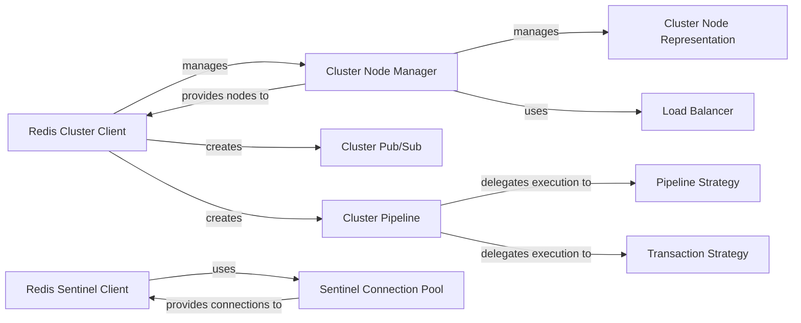

## Component Details

This graph illustrates the architecture of the High Availability & Cluster Management subsystem, focusing on how Redis Cluster and Redis Sentinel functionalities are provided. It details the components responsible for node discovery, command routing, pipeline execution, and high-availability management in both cluster and sentinel environments.

### Redis Cluster Client

The Redis Cluster Client (`RedisCluster`) serves as the primary interface for applications to interact with a Redis Cluster. It handles command routing to appropriate nodes, manages retries on MOVED/ASK errors, and provides methods for obtaining pipeline and pub/sub instances. It supports both synchronous and asynchronous operations.

**Related Classes/Methods**:

- <a href="https://github.com/redis/redis-py/blob/master/redis/cluster.py#L456-L1000" target="_blank" rel="noopener noreferrer">`redis.cluster.RedisCluster` (456:1000)</a>

- <a href="https://github.com/redis/redis-py/blob/master/redis/cluster.py#L513-L712" target="_blank" rel="noopener noreferrer">`redis.cluster.RedisCluster:__init__` (513:712)</a>

- `redis.cluster.RedisCluster:execute_command` (full file reference)

- <a href="https://github.com/redis/redis-py/blob/master/redis/cluster.py#L841-L866" target="_blank" rel="noopener noreferrer">`redis.cluster.RedisCluster:pipeline` (841:866)</a>

- <a href="https://github.com/redis/redis-py/blob/master/redis/cluster.py#L834-L839" target="_blank" rel="noopener noreferrer">`redis.cluster.RedisCluster:pubsub` (834:839)</a>

- `redis.asyncio.cluster.RedisCluster:__init__` (full file reference)

- `redis.asyncio.cluster.RedisCluster:execute_command` (full file reference)

- `redis.asyncio.cluster.RedisCluster:pipeline` (full file reference)

### Cluster Node Manager

The Cluster Node Manager (`NodesManager`) is responsible for discovering and maintaining the topology of the Redis Cluster. It manages the cache of active nodes and their assigned slots, handles updates for MOVED exceptions, and initializes Redis connections to cluster nodes. It also integrates with a load balancer for read operations.

**Related Classes/Methods**:

- `redis.cluster.NodesManager:__init__` (full file reference)

- `redis.cluster.NodesManager:initialize` (full file reference)

- `redis.cluster.NodesManager:get_node_from_slot` (full file reference)

- `redis.asyncio.cluster.NodesManager:__init__` (full file reference)

- `redis.asyncio.cluster.NodesManager:initialize` (full file reference)

- `redis.asyncio.cluster.NodesManager:get_node_from_slot` (full file reference)

### Cluster Node Representation

The Cluster Node Representation (`ClusterNode`) encapsulates the details of a single Redis instance within the cluster, including its host, port, name, and server type (primary or replica). It also holds a reference to the Redis connection object for that specific node.

**Related Classes/Methods**:

- `redis.cluster.ClusterNode:__init__` (full file reference)

- `redis.asyncio.cluster.ClusterNode:__init__` (full file reference)

### Load Balancer

The Load Balancer (`LoadBalancer`) provides strategies for distributing read requests across multiple replica nodes associated with a primary. It supports round-robin and random replica selection to optimize read performance and distribute load.

**Related Classes/Methods**:

- `redis.cluster.LoadBalancer:get_server_index` (full file reference)

### Cluster Pub/Sub

The Cluster Pub/Sub (`ClusterPubSub`) component extends the standard Redis Pub/Sub functionality to work within a Redis Cluster environment. It manages the pub/sub connection to a specific cluster node, determined by channel keyslots or a random node.

**Related Classes/Methods**:

- `redis.cluster.ClusterPubSub:__init__` (full file reference)

- `redis.cluster.ClusterPubSub:execute_command` (full file reference)

- `redis.asyncio.cluster.ClusterPubSub:__init__` (full file reference)

### Cluster Pipeline

The Cluster Pipeline (`ClusterPipeline`) enables batching of multiple Redis commands for efficient execution within a Redis Cluster. It collects commands and then delegates their execution to specific strategies (PipelineStrategy or TransactionStrategy) based on whether a transaction is involved.

**Related Classes/Methods**:

- `redis.cluster.ClusterPipeline:__init__` (full file reference)

- `redis.cluster.ClusterPipeline:execute` (full file reference)

- `redis.asyncio.cluster.ClusterPipeline:__init__` (full file reference)

- `redis.asyncio.cluster.ClusterPipeline:execute` (full file reference)

### Pipeline Strategy

The Pipeline Strategy (`PipelineStrategy`) defines how a batch of commands collected by the Cluster Pipeline is executed across the Redis Cluster. It handles routing commands to the correct nodes and processing their responses, without transactional guarantees.

**Related Classes/Methods**:

- `redis.cluster.PipelineStrategy:__init__` (full file reference)

- `redis.cluster.PipelineStrategy:execute` (full file reference)

- `redis.asyncio.cluster.PipelineStrategy:__init__` (full file reference)

- `redis.asyncio.cluster.PipelineStrategy:execute` (full file reference)

### Transaction Strategy

The Transaction Strategy (`TransactionStrategy`) implements the logic for executing Redis transactions (MULTI/EXEC) within a Redis Cluster. It ensures that all commands within a transaction are sent to the same node and handles WATCH errors and retries.

**Related Classes/Methods**:

- `redis.cluster.TransactionStrategy:__init__` (full file reference)

- `redis.cluster.TransactionStrategy:execute` (full file reference)

- `redis.asyncio.cluster.TransactionStrategy:__init__` (full file reference)

- `redis.asyncio.cluster.TransactionStrategy:execute` (full file reference)

### Redis Sentinel Client

The Redis Sentinel Client (`Sentinel`) provides an interface for applications to connect to Redis instances managed by Sentinel for high availability. It discovers the current master and available replicas for a given service name.

**Related Classes/Methods**:

- <a href="https://github.com/redis/redis-py/blob/master/redis/sentinel.py#L198-L410" target="_blank" rel="noopener noreferrer">`redis.sentinel.Sentinel` (198:410)</a>

- <a href="https://github.com/redis/redis-py/blob/master/redis/sentinel.py#L227-L249" target="_blank" rel="noopener noreferrer">`redis.sentinel.Sentinel:__init__` (227:249)</a>

- <a href="https://github.com/redis/redis-py/blob/master/redis/sentinel.py#L343-L379" target="_blank" rel="noopener noreferrer">`redis.sentinel.Sentinel:master_for` (343:379)</a>

- <a href="https://github.com/redis/redis-py/blob/master/redis/asyncio/sentinel.py#L196-L218" target="_blank" rel="noopener noreferrer">`redis.asyncio.sentinel.Sentinel:__init__` (196:218)</a>

- <a href="https://github.com/redis/redis-py/blob/master/redis/asyncio/sentinel.py#L320-L357" target="_blank" rel="noopener noreferrer">`redis.asyncio.sentinel.Sentinel:master_for` (320:357)</a>

### Sentinel Connection Pool

The Sentinel Connection Pool (`SentinelConnectionPool` and `SentinelManagedConnection`) manages the underlying network connections to Redis master and replica instances discovered via Sentinel. It ensures efficient connection reuse and handles connection lifecycle.

**Related Classes/Methods**:

- <a href="https://github.com/redis/redis-py/blob/master/redis/sentinel.py#L145-L166" target="_blank" rel="noopener noreferrer">`redis.sentinel.SentinelConnectionPool:__init__` (145:166)</a>

- <a href="https://github.com/redis/redis-py/blob/master/redis/sentinel.py#L21-L23" target="_blank" rel="noopener noreferrer">`redis.sentinel.SentinelManagedConnection:__init__` (21:23)</a>

- <a href="https://github.com/redis/redis-py/blob/master/redis/asyncio/sentinel.py#L104-L120" target="_blank" rel="noopener noreferrer">`redis.asyncio.sentinel.SentinelConnectionPool:__init__` (104:120)</a>

- <a href="https://github.com/redis/redis-py/blob/master/redis/asyncio/sentinel.py#L27-L29" target="_blank" rel="noopener noreferrer">`redis.asyncio.sentinel.SentinelManagedConnection:__init__` (27:29)</a>

### [FAQ](https://github.com/CodeBoarding/GeneratedOnBoardings/tree/main?tab=readme-ov-file#faq)