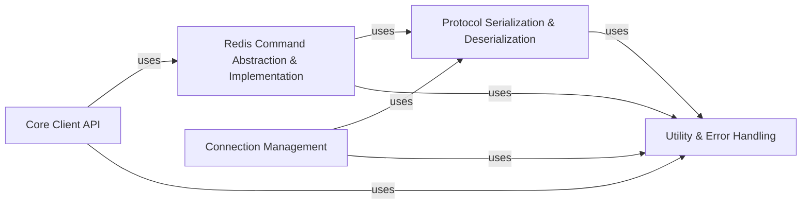

## Details

The `Protocol & Command Handling` subsystem is a critical part of the `redis-py` client library, responsible for the fundamental communication with the Redis server.

### Protocol Serialization & Deserialization

This component is responsible for the low-level conversion of Python data structures into the Redis Serialization Protocol (RESP) format for outgoing commands and the efficient parsing of RESP responses received from the Redis server back into native Python data types. It supports different RESP versions (RESP2 and RESP3) and leverages optimized parsers, including the `hiredis` C extension for performance. This component acts as the crucial bridge between the Python application's data representation and Redis's wire protocol.

**Related Classes/Methods**:

- `BaseParser`

- `AsyncBaseParser`

- `_RESPBase`

- `_AsyncRESPBase`

- `_HiredisParser`

- `_AsyncHiredisParser`

- `_RESP2Parser`

- `_AsyncRESP2Parser`

- `_RESP3Parser`

- `_AsyncRESP3Parser`

- `Encoder`

### Redis Command Abstraction & Implementation

This component defines and implements the comprehensive set of Redis commands, providing a Pythonic interface for interacting with Redis functionalities. It encompasses both the core Redis commands (e.g., key-value operations, hashes, lists, sets, sorted sets, streams, geospatial commands, hyperloglog, scanning, ACL, cluster, functions, management, pub/sub, scripting) and specialized commands for various Redis modules (e.g., RedisBloom, RedisJSON, RediSearch, RedisTimeSeries, VectorSearch). This component abstracts the raw command strings and arguments into user-friendly Python methods.

**Related Classes/Methods**:

- `CoreCommands`

- `AsyncCoreCommands`

- `RedisModuleCommands`

- `AsyncRedisModuleCommands`

- `BFCommands`

- `CFCommands`

- `JSONCommands`

- `SearchCommands`

- `AsyncSearchCommands`

- `TimeSeriesCommands`

- `VectorSetCommands`

### Core Client API

Provides a simplified, unified interface to the extensive set of Redis commands.

**Related Classes/Methods**: _None_

### Connection Management [[Expand]](./Connection_Management.md)

Responsible for the actual sending and receiving of bytes over the network.

**Related Classes/Methods**: _None_

### Utility & Error Handling

Provides consistent exception handling and potentially shared utility functions.

**Related Classes/Methods**: _None_

### [FAQ](https://github.com/CodeBoarding/GeneratedOnBoardings/tree/main?tab=readme-ov-file#faq)