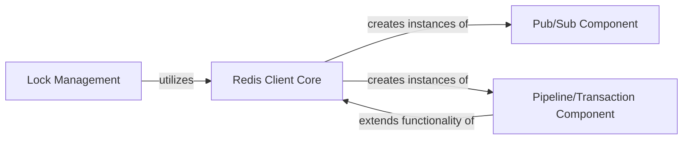

## Component Details

This graph illustrates the core components of the Redis client library, focusing on the primary interface for Redis interaction, `Redis Client Core`, and its specialized functionalities. It details how `Redis Client Core` orchestrates operations, including the creation of `Pub/Sub Component` for real-time messaging and `Pipeline/Transaction Component` for efficient batched commands. Additionally, it shows how `Lock Management` leverages the `Redis Client Core` for distributed locking, and how the `Pipeline/Transaction Component` builds upon the core client's capabilities.

### Redis Client Core

The Redis Client Core component serves as the primary interface for interacting with a Redis server. It manages connection pools, executes commands, handles command parsing, and provides entry points for advanced functionalities like pipelining and publish/subscribe.

**Related Classes/Methods**:

- <a href="https://github.com/redis/redis-py/blob/master/redis/client.py#L112-L670" target="_blank" rel="noopener noreferrer">`redis.client.Redis` (112:670)</a>

- <a href="https://github.com/redis/redis-py/blob/master/redis/client.py#L128-L176" target="_blank" rel="noopener noreferrer">`redis.client.Redis:from_url` (128:176)</a>

- <a href="https://github.com/redis/redis-py/blob/master/redis/client.py#L179-L192" target="_blank" rel="noopener noreferrer">`redis.client.Redis:from_pool` (179:192)</a>

- <a href="https://github.com/redis/redis-py/blob/master/redis/client.py#L199-L389" target="_blank" rel="noopener noreferrer">`redis.client.Redis:__init__` (199:389)</a>

- <a href="https://github.com/redis/redis-py/blob/master/redis/client.py#L405-L406" target="_blank" rel="noopener noreferrer">`redis.client.Redis:get_retry` (405:406)</a>

- <a href="https://github.com/redis/redis-py/blob/master/redis/client.py#L408-L410" target="_blank" rel="noopener noreferrer">`redis.client.Redis:set_retry` (408:410)</a>

- <a href="https://github.com/redis/redis-py/blob/master/redis/client.py#L439-L449" target="_blank" rel="noopener noreferrer">`redis.client.Redis:pipeline` (439:449)</a>

- <a href="https://github.com/redis/redis-py/blob/master/redis/client.py#L451-L473" target="_blank" rel="noopener noreferrer">`redis.client.Redis:transaction` (451:473)</a>

- <a href="https://github.com/redis/redis-py/blob/master/redis/client.py#L556-L564" target="_blank" rel="noopener noreferrer">`redis.client.Redis:pubsub` (556:564)</a>

- <a href="https://github.com/redis/redis-py/blob/master/redis/client.py#L566-L567" target="_blank" rel="noopener noreferrer">`redis.client.Redis:monitor` (566:567)</a>

- <a href="https://github.com/redis/redis-py/blob/master/redis/client.py#L569-L572" target="_blank" rel="noopener noreferrer">`redis.client.Redis:client` (569:572)</a>

- <a href="https://github.com/redis/redis-py/blob/master/redis/client.py#L577-L578" target="_blank" rel="noopener noreferrer">`redis.client.Redis:__exit__` (577:578)</a>

- <a href="https://github.com/redis/redis-py/blob/master/redis/client.py#L580-L584" target="_blank" rel="noopener noreferrer">`redis.client.Redis:__del__` (580:584)</a>

- <a href="https://github.com/redis/redis-py/blob/master/redis/client.py#L601-L606" target="_blank" rel="noopener noreferrer">`redis.client.Redis:_send_command_parse_response` (601:606)</a>

- <a href="https://github.com/redis/redis-py/blob/master/redis/client.py#L622-L623" target="_blank" rel="noopener noreferrer">`redis.client.Redis:execute_command` (622:623)</a>

- <a href="https://github.com/redis/redis-py/blob/master/redis/client.py#L625-L644" target="_blank" rel="noopener noreferrer">`redis.client.Redis:_execute_command` (625:644)</a>

### Lock Management

The Lock Management component provides functionalities for acquiring, releasing, extending, and reacquiring distributed locks in Redis. It handles the underlying Redis commands and manages lock ownership and expiration, raising specific exceptions for lock-related errors.

**Related Classes/Methods**:

- <a href="https://github.com/redis/redis-py/blob/master/redis/lock.py#L14-L343" target="_blank" rel="noopener noreferrer">`redis.lock.Lock` (14:343)</a>

- <a href="https://github.com/redis/redis-py/blob/master/redis/lock.py#L79-L155" target="_blank" rel="noopener noreferrer">`redis.lock.Lock:__init__` (79:155)</a>

- <a href="https://github.com/redis/redis-py/blob/master/redis/lock.py#L167-L173" target="_blank" rel="noopener noreferrer">`redis.lock.Lock:__enter__` (167:173)</a>

- <a href="https://github.com/redis/redis-py/blob/master/redis/lock.py#L175-L188" target="_blank" rel="noopener noreferrer">`redis.lock.Lock:__exit__` (175:188)</a>

- <a href="https://github.com/redis/redis-py/blob/master/redis/lock.py#L190-L235" target="_blank" rel="noopener noreferrer">`redis.lock.Lock:acquire` (190:235)</a>

- <a href="https://github.com/redis/redis-py/blob/master/redis/lock.py#L265-L276" target="_blank" rel="noopener noreferrer">`redis.lock.Lock:release` (265:276)</a>

- <a href="https://github.com/redis/redis-py/blob/master/redis/lock.py#L237-L245" target="_blank" rel="noopener noreferrer">`redis.lock.Lock:do_acquire` (237:245)</a>

- <a href="https://github.com/redis/redis-py/blob/master/redis/lock.py#L278-L285" target="_blank" rel="noopener noreferrer">`redis.lock.Lock:do_release` (278:285)</a>

- <a href="https://github.com/redis/redis-py/blob/master/redis/lock.py#L287-L302" target="_blank" rel="noopener noreferrer">`redis.lock.Lock:extend` (287:302)</a>

- <a href="https://github.com/redis/redis-py/blob/master/redis/lock.py#L304-L317" target="_blank" rel="noopener noreferrer">`redis.lock.Lock:do_extend` (304:317)</a>

- <a href="https://github.com/redis/redis-py/blob/master/redis/lock.py#L319-L330" target="_blank" rel="noopener noreferrer">`redis.lock.Lock:reacquire` (319:330)</a>

- <a href="https://github.com/redis/redis-py/blob/master/redis/lock.py#L332-L343" target="_blank" rel="noopener noreferrer">`redis.lock.Lock:do_reacquire` (332:343)</a>

### Pub/Sub Component

The Pub/Sub Component facilitates real-time messaging through Redis's publish/subscribe mechanism. It allows clients to subscribe to channels or patterns, receive messages, and manage the lifecycle of the pub/sub connection.

**Related Classes/Methods**:

- <a href="https://github.com/redis/redis-py/blob/master/redis/client.py#L743-L1000" target="_blank" rel="noopener noreferrer">`redis.client.PubSub` (743:1000)</a>

- <a href="https://github.com/redis/redis-py/blob/master/redis/client.py#L756-L791" target="_blank" rel="noopener noreferrer">`redis.client.PubSub:__init__` (756:791)</a>

- <a href="https://github.com/redis/redis-py/blob/master/redis/client.py#L796-L797" target="_blank" rel="noopener noreferrer">`redis.client.PubSub:__exit__` (796:797)</a>

- <a href="https://github.com/redis/redis-py/blob/master/redis/client.py#L799-L806" target="_blank" rel="noopener noreferrer">`redis.client.PubSub:__del__` (799:806)</a>

- <a href="https://github.com/redis/redis-py/blob/master/redis/client.py#L823-L824" target="_blank" rel="noopener noreferrer">`redis.client.PubSub:close` (823:824)</a>

- <a href="https://github.com/redis/redis-py/blob/master/redis/client.py#L826-L849" target="_blank" rel="noopener noreferrer">`redis.client.PubSub:on_connect` (826:849)</a>

- <a href="https://github.com/redis/redis-py/blob/master/redis/client.py#L856-L880" target="_blank" rel="noopener noreferrer">`redis.client.PubSub:execute_command` (856:880)</a>

- <a href="https://github.com/redis/redis-py/blob/master/redis/client.py#L882-L898" target="_blank" rel="noopener noreferrer">`redis.client.PubSub:clean_health_check_responses` (882:898)</a>

- <a href="https://github.com/redis/redis-py/blob/master/redis/client.py#L910-L921" target="_blank" rel="noopener noreferrer">`redis.client.PubSub:_execute` (910:921)</a>

- <a href="https://github.com/redis/redis-py/blob/master/redis/client.py#L923-L948" target="_blank" rel="noopener noreferrer">`redis.client.PubSub:parse_response` (923:948)</a>

- <a href="https://github.com/redis/redis-py/blob/master/redis/client.py#L983-L1000" target="_blank" rel="noopener noreferrer">`redis.client.PubSub:psubscribe` (983:1000)</a>

- `redis.client.PubSub:punsubscribe` (full file reference)

- `redis.client.PubSub:subscribe` (full file reference)

- `redis.client.PubSub:unsubscribe` (full file reference)

- `redis.client.PubSub:ssubscribe` (full file reference)

- `redis.client.PubSub:sunsubscribe` (full file reference)

- `redis.client.PubSub:listen` (full file reference)

- `redis.client.PubSub:get_message` (full file reference)

- `redis.client.PubSub:ping` (full file reference)

- `redis.client.PubSub:handle_message` (full file reference)

- `redis.client.PubSub:run_in_thread` (full file reference)

### Pipeline/Transaction Component

The Pipeline/Transaction Component enables efficient execution of multiple Redis commands by sending them in a single round trip (pipelining) and supports atomic transactions using MULTI/EXEC. It manages command queuing, response parsing, and error handling for batched operations.

**Related Classes/Methods**:

- <a href="https://github.com/redis/redis-py/blob/master/redis/client.py#L1-L1000" target="_blank" rel="noopener noreferrer">`redis.client.Pipeline` (1:1000)</a>

- `redis.client.Pipeline:__exit__` (full file reference)

- `redis.client.Pipeline:__del__` (full file reference)

- `redis.client.Pipeline:close` (full file reference)

- `redis.client.Pipeline:multi` (full file reference)

- `redis.client.Pipeline:execute_command` (full file reference)

- `redis.client.Pipeline:_disconnect_reset_raise_on_watching` (full file reference)

- `redis.client.Pipeline:immediate_execute_command` (full file reference)

- `redis.client.Pipeline:_execute_transaction` (full file reference)

- `redis.client.Pipeline:_execute_pipeline` (full file reference)

- `redis.client.Pipeline:raise_first_error` (full file reference)

- `redis.client.Pipeline:annotate_exception` (full file reference)

- `redis.client.Pipeline:parse_response` (full file reference)

- `redis.client.Pipeline:load_scripts` (full file reference)

- `redis.client.Pipeline:_disconnect_raise_on_watching` (full file reference)

- `redis.client.Pipeline:execute` (full file reference)

- `redis.client.Pipeline:discard` (full file reference)

- `redis.client.Pipeline:watch` (full file reference)

- `redis.client.Pipeline:unwatch` (full file reference)

### [FAQ](https://github.com/CodeBoarding/GeneratedOnBoardings/tree/main?tab=readme-ov-file#faq)