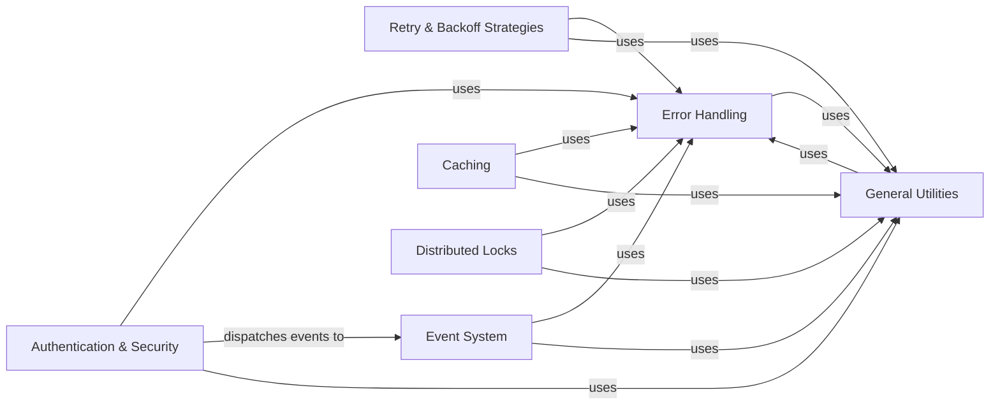

## Details

One paragraph explaining the functionality which is represented by this graph. What the main flow is and what is its purpose.

### Authentication & Security

This component is fundamental as it ensures secure communication and proper authorization, which are paramount for any client library interacting with a data store like Redis. It handles credential provision, token management, and certificate validation (e.g., OCSP stapling), directly addressing the "authentication mechanisms" aspect.

**Related Classes/Methods**:

- <a href="https://github.com/redis/redis-py/blob/master/redis/credentials.py" target="_blank" rel="noopener noreferrer">`redis/credentials.py`</a>

- <a href="https://github.com/redis/redis-py/blob/master/redis/auth/token.py" target="_blank" rel="noopener noreferrer">`redis/auth/token.py`</a>

- <a href="https://github.com/redis/redis-py/blob/master/redis/auth/token_manager.py" target="_blank" rel="noopener noreferrer">`redis/auth/token_manager.py`</a>

- <a href="https://github.com/redis/redis-py/blob/master/redis/ocsp.py" target="_blank" rel="noopener noreferrer">`redis/ocsp.py`</a>

### Error Handling

This component is crucial for building a robust and user-friendly client library. A well-defined and comprehensive exception hierarchy allows developers to gracefully handle various issues, improving application stability and debugging. It directly addresses the "robust error handling" aspect.

**Related Classes/Methods**:

- <a href="https://github.com/redis/redis-py/blob/master/redis/exceptions.py" target="_blank" rel="noopener noreferrer">`redis/exceptions.py`</a>

### Retry & Backoff Strategies

This component is essential for resilience in distributed systems. Transient failures (e.g., network glitches, temporary server unavailability) are common, and automatic retries with intelligent backoff mechanisms prevent applications from crashing, reduce load on the server during recovery, and improve overall reliability. It directly addresses the "retry strategies" and "backoff" aspects.

**Related Classes/Methods**:

- <a href="https://github.com/redis/redis-py/blob/master/redis/retry.py" target="_blank" rel="noopener noreferrer">`redis/retry.py`</a>

- <a href="https://github.com/redis/redis-py/blob/master/redis/backoff.py" target="_blank" rel="noopener noreferrer">`redis/backoff.py`</a>

### Event System

This component provides a flexible and decoupled way for different parts of the library to communicate and react to internal state changes, such as connection status updates or re-authentication requirements. This promotes a clean architecture and enables dynamic behavior within the client. It directly addresses the "internal event system" aspect.

**Related Classes/Methods**:

- <a href="https://github.com/redis/redis-py/blob/master/redis/event.py" target="_blank" rel="noopener noreferrer">`redis/event.py`</a>

### Caching

This component is fundamental for performance optimization in client libraries. By providing client-side caching capabilities, it reduces redundant network calls to the Redis server, significantly improving response times and reducing server load for frequently accessed data. It directly addresses the "caching" aspect.

**Related Classes/Methods**:

- <a href="https://github.com/redis/redis-py/blob/master/redis/cache.py" target="_blank" rel="noopener noreferrer">`redis/cache.py`</a>

### Distributed Locks

This component implements higher-level Redis commands that provide distributed synchronization mechanisms, most notably distributed locks. These primitives are essential for coordinating operations across multiple clients or processes in a distributed environment, preventing race conditions and ensuring data consistency. It directly addresses the "distributed synchronization primitives like locks" aspect.

**Related Classes/Methods**:

- <a href="https://github.com/redis/redis-py/blob/master/redis/lock.py" target="_blank" rel="noopener noreferrer">`redis/lock.py`</a>

- <a href="https://github.com/redis/redis-py/blob/master/redis/asyncio/lock.py" target="_blank" rel="noopener noreferrer">`redis/asyncio/lock.py`</a>

### General Utilities

This component provides a collection of general-purpose helper functions and utilities that are widely used across various parts of the library. It centralizes reusable code, preventing duplication, promoting consistency, and simplifying development across different modules. It directly addresses the "common utilities" aspect.

**Related Classes/Methods**:

- <a href="https://github.com/redis/redis-py/blob/master/redis/utils.py" target="_blank" rel="noopener noreferrer">`redis/utils.py`</a>

### [FAQ](https://github.com/CodeBoarding/GeneratedOnBoardings/tree/main?tab=readme-ov-file#faq)