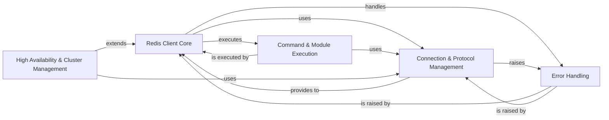

## Component Details

The `redis-py` library provides a Python interface to the Redis key-value store. Its main flow involves establishing connections to Redis servers, executing various Redis commands, handling responses, and managing advanced features like pipelining, transactions, and publish/subscribe. It also supports specialized deployments such as Redis Cluster and Redis Sentinel for high availability and scalability. The architecture is designed to be modular, separating concerns like connection management, command execution, and error handling.

### Redis Client Core
The primary interface for interacting with Redis, encompassing basic command execution, pipelining, transactions, publish/subscribe, and distributed locking mechanisms. It orchestrates high-level operations.

**Related Classes/Methods**:

- <a href="https://github.com/redis/redis-py/blob/master/redis/client.py#L112-L670" target="_blank" rel="noopener noreferrer">`redis.client.Redis` (112:670)</a>
- <a href="https://github.com/redis/redis-py/blob/master/redis/client.py#L1-L1000" target="_blank" rel="noopener noreferrer">`redis.client.Pipeline` (1:1000)</a>
- <a href="https://github.com/redis/redis-py/blob/master/redis/client.py#L743-L1000" target="_blank" rel="noopener noreferrer">`redis.client.PubSub` (743:1000)</a>
- <a href="https://github.com/redis/redis-py/blob/master/redis/lock.py#L14-L343" target="_blank" rel="noopener noreferrer">`redis.lock.Lock` (14:343)</a>

### Connection & Protocol Management
Manages the lifecycle of connections to Redis servers, including pooling, health checks, and various connection types. It also handles the encoding of commands and parsing of responses, along with authentication and caching.

**Related Classes/Methods**:

- <a href="https://github.com/redis/redis-py/blob/master/redis/connection.py#L1-L1000" target="_blank" rel="noopener noreferrer">`redis.connection.ConnectionPool` (1:1000)</a>
- <a href="https://github.com/redis/redis-py/blob/master/redis/_parsers/resp3.py#L15-L131" target="_blank" rel="noopener noreferrer">`redis._parsers.resp3._RESP3Parser` (15:131)</a>
- <a href="https://github.com/redis/redis-py/blob/master/redis/auth/token_manager.py#L121-L340" target="_blank" rel="noopener noreferrer">`redis.auth.token_manager.TokenManager` (121:340)</a>
- <a href="https://github.com/redis/redis-py/blob/master/redis/cache.py#L142-L224" target="_blank" rel="noopener noreferrer">`redis.cache.DefaultCache` (142:224)</a>
- <a href="https://github.com/redis/redis-py/blob/master/redis/ocsp.py#L170-L308" target="_blank" rel="noopener noreferrer">`redis.ocsp.OCSPVerifier` (170:308)</a>

### Command & Module Execution
Implements and executes the full range of standard Redis commands (e.g., key-value, list, set, hash, stream operations) and provides interfaces for interacting with various Redis Modules (e.g., JSON, Search, TimeSeries).

**Related Classes/Methods**:

- <a href="https://github.com/redis/redis-py/blob/master/redis/commands/core.py#L1-L1000" target="_blank" rel="noopener noreferrer">`redis.commands.core.BasicKeyCommands` (1:1000)</a>
- `redis.commands.json.JSON` (1:1000)

### High Availability & Cluster Management
Provides specialized client functionalities for interacting with Redis Cluster and Redis Sentinel setups. It handles node discovery, slot management, command routing in clusters, and master/replica discovery with failover in Sentinel environments.

**Related Classes/Methods**:

- <a href="https://github.com/redis/redis-py/blob/master/redis/cluster.py#L456-L1000" target="_blank" rel="noopener noreferrer">`redis.cluster.RedisCluster` (456:1000)</a>
- <a href="https://github.com/redis/redis-py/blob/master/redis/sentinel.py#L198-L410" target="_blank" rel="noopener noreferrer">`redis.sentinel.Sentinel` (198:410)</a>

### Error Handling
Defines and manages custom exception classes for various Redis-related errors, providing a structured and specific way to handle different error scenarios that can occur during client-server interactions.

**Related Classes/Methods**:

- <a href="https://github.com/redis/redis-py/blob/master/redis/exceptions.py#L4-L5" target="_blank" rel="noopener noreferrer">`redis.exceptions.RedisError` (4:5)</a>

### [FAQ](https://github.com/CodeBoarding/GeneratedOnBoardings/tree/main?tab=readme-ov-file#faq)