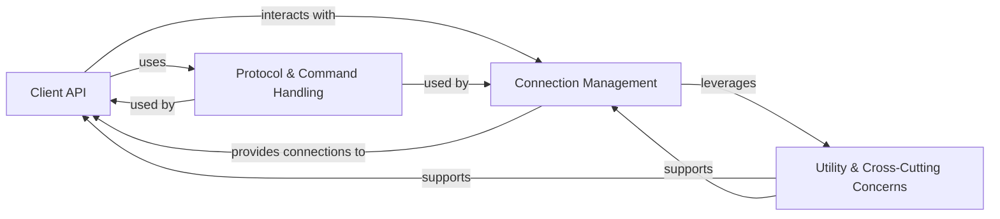

## Details

The redis-py library is designed with a clear layered architecture, where the Client API acts as the primary facade for users. This API delegates connection management to the Connection Management layer, which in turn relies on the Protocol & Command Handling layer for data serialization and deserialization. Various Utility & Cross-Cutting Concerns provide essential supporting services across these layers, ensuring robustness, security, and efficiency.

### Client API [[Expand]](./Client_API.md)

The primary interface for users to interact with Redis. It provides high-level methods for executing Redis commands, managing command pipelines, and handling transactions. It supports both synchronous and asynchronous operations, abstracting the underlying network communication.

**Related Classes/Methods**:

- <a href="https://github.com/redis/redis-py/blob/master/redis/client.py#L1-L1" target="_blank" rel="noopener noreferrer">`redis.client` (1:1)</a>

- <a href="https://github.com/redis/redis-py/blob/master/redis/asyncio/client.py#L1-L1" target="_blank" rel="noopener noreferrer">`redis.asyncio.client` (1:1)</a>

### Connection Management [[Expand]](./Connection_Management.md)

Responsible for establishing, maintaining, and pooling connections to various Redis deployments (standalone, Sentinel, Cluster). It handles connection lifecycle, including retries, error handling, and routing commands to appropriate nodes based on the deployment type.

**Related Classes/Methods**:

- <a href="https://github.com/redis/redis-py/blob/master/redis/connection.py#L1-L1" target="_blank" rel="noopener noreferrer">`redis.connection` (1:1)</a>

- <a href="https://github.com/redis/redis-py/blob/master/redis/asyncio/connection.py#L1-L1" target="_blank" rel="noopener noreferrer">`redis.asyncio.connection` (1:1)</a>

- <a href="https://github.com/redis/redis-py/blob/master/redis/sentinel.py#L1-L1" target="_blank" rel="noopener noreferrer">`redis.sentinel` (1:1)</a>

- <a href="https://github.com/redis/redis-py/blob/master/redis/asyncio/sentinel.py#L1-L1" target="_blank" rel="noopener noreferrer">`redis.asyncio.sentinel` (1:1)</a>

- <a href="https://github.com/redis/redis-py/blob/master/redis/cluster.py#L1-L1" target="_blank" rel="noopener noreferrer">`redis.cluster` (1:1)</a>

- <a href="https://github.com/redis/redis-py/blob/master/redis/asyncio/cluster.py#L1-L1" target="_blank" rel="noopener noreferrer">`redis.asyncio.cluster` (1:1)</a>

### Protocol & Command Handling [[Expand]](./Protocol_Command_Handling.md)

Encapsulates the logic for converting Python data into the Redis Serialization Protocol (RESP) format for outgoing commands and parsing RESP responses back into Python data types. It also defines the structure and arguments for all Redis commands, including specialized module commands (e.g., RedisJSON, RediSearch).

**Related Classes/Methods**:

- <a href="https://github.com/redis/redis-py/blob/master/redis/_parsers/base.py#L1-L1" target="_blank" rel="noopener noreferrer">`redis._parsers.base` (1:1)</a>

- <a href="https://github.com/redis/redis-py/blob/master/redis/_parsers/hiredis.py#L1-L1" target="_blank" rel="noopener noreferrer">`redis._parsers.hiredis` (1:1)</a>

- <a href="https://github.com/redis/redis-py/blob/master/redis/_parsers/resp2.py#L1-L1" target="_blank" rel="noopener noreferrer">`redis._parsers.resp2` (1:1)</a>

- <a href="https://github.com/redis/redis-py/blob/master/redis/_parsers/resp3.py#L1-L1" target="_blank" rel="noopener noreferrer">`redis._parsers.resp3` (1:1)</a>

- <a href="https://github.com/redis/redis-py/blob/master/redis/_parsers/encoders.py#L1-L1" target="_blank" rel="noopener noreferrer">`redis._parsers.encoders` (1:1)</a>

- <a href="https://github.com/redis/redis-py/blob/master/redis/commands/core.py#L1-L1" target="_blank" rel="noopener noreferrer">`redis.commands.core` (1:1)</a>

- `redis.commands.bf` (1:1)

- `redis.commands.json` (1:1)

- `redis.commands.search` (1:1)

- `redis.commands.timeseries` (1:1)

- `redis.commands.vectorset` (1:1)

### Utility & Cross-Cutting Concerns [[Expand]](./Utility_Cross_Cutting_Concerns.md)

A collection of foundational services and common utilities that support the core functionality of the library. This includes authentication mechanisms, robust error handling, retry strategies, an internal event system, caching, and distributed synchronization primitives like locks.

**Related Classes/Methods**:

- <a href="https://github.com/redis/redis-py/blob/master/redis/credentials.py#L1-L1" target="_blank" rel="noopener noreferrer">`redis.credentials` (1:1)</a>

- <a href="https://github.com/redis/redis-py/blob/master/redis/auth/token.py#L1-L1" target="_blank" rel="noopener noreferrer">`redis.auth.token` (1:1)</a>

- <a href="https://github.com/redis/redis-py/blob/master/redis/auth/token_manager.py#L1-L1" target="_blank" rel="noopener noreferrer">`redis.auth.token_manager` (1:1)</a>

- <a href="https://github.com/redis/redis-py/blob/master/redis/ocsp.py#L1-L1" target="_blank" rel="noopener noreferrer">`redis.ocsp` (1:1)</a>

- <a href="https://github.com/redis/redis-py/blob/master/redis/exceptions.py#L1-L1" target="_blank" rel="noopener noreferrer">`redis.exceptions` (1:1)</a>

- <a href="https://github.com/redis/redis-py/blob/master/redis/retry.py#L1-L1" target="_blank" rel="noopener noreferrer">`redis.retry` (1:1)</a>

- <a href="https://github.com/redis/redis-py/blob/master/redis/backoff.py#L1-L1" target="_blank" rel="noopener noreferrer">`redis.backoff` (1:1)</a>

- <a href="https://github.com/redis/redis-py/blob/master/redis/event.py#L1-L1" target="_blank" rel="noopener noreferrer">`redis.event` (1:1)</a>

- <a href="https://github.com/redis/redis-py/blob/master/redis/cache.py#L1-L1" target="_blank" rel="noopener noreferrer">`redis.cache` (1:1)</a>

- <a href="https://github.com/redis/redis-py/blob/master/redis/lock.py#L1-L1" target="_blank" rel="noopener noreferrer">`redis.lock` (1:1)</a>

- <a href="https://github.com/redis/redis-py/blob/master/redis/asyncio/lock.py#L1-L1" target="_blank" rel="noopener noreferrer">`redis.asyncio.lock` (1:1)</a>

- <a href="https://github.com/redis/redis-py/blob/master/redis/utils.py#L1-L1" target="_blank" rel="noopener noreferrer">`redis.utils` (1:1)</a>

### [FAQ](https://github.com/CodeBoarding/GeneratedOnBoardings/tree/main?tab=readme-ov-file#faq)