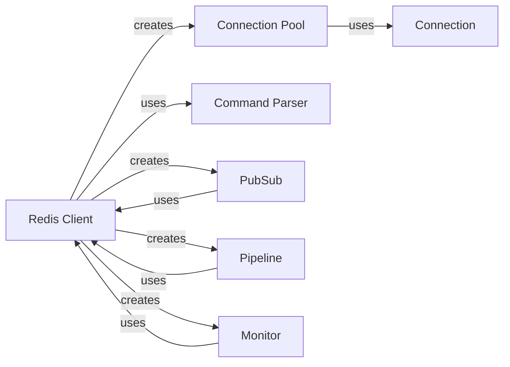

## Component Details

The Redis client library provides a comprehensive interface for interacting with Redis servers, supporting both synchronous and asynchronous operations. It encompasses connection management, command execution, and response handling, offering features like PubSub, Pipelines, and Monitoring. The core components work together to provide a robust and efficient way to interact with Redis.

### Redis Client
The Redis Client serves as the primary interface for interacting with a Redis server. It manages connections, executes commands, and handles responses. It supports both synchronous and asynchronous operations, allowing users to interact with Redis in a non-blocking manner. The client can be configured to connect to a single Redis instance or a Redis cluster.
- **Related Classes/Methods**: `redis.client.Redis` (112:670), `redis.asyncio.client.Redis` (109:715)

### Connection Pool
The Connection Pool manages a pool of reusable connections to the Redis server. This improves performance by reducing the overhead of establishing new connections for each request. The connection pool handles connection creation, recycling, and error handling, ensuring efficient use of resources.
- **Related Classes/Methods**: `redis.connection.ConnectionPool` (1309:1654), `redis.asyncio.connection.ConnectionPool` (1031:1253)

### Connection
The Connection class represents a single connection to the Redis server. It handles the low-level details of socket communication, including sending commands and receiving responses. It provides methods for reading and writing data to the socket, as well as handling connection errors.
- **Related Classes/Methods**: `redis.connection.Connection` (730:801), `redis.asyncio.connection.Connection` (723:777)

### Command Parser
The Command Parser is responsible for parsing the responses received from the Redis server. It converts the raw byte strings into Python data types, such as strings, integers, lists, and dictionaries. The parser handles different response formats and error conditions, ensuring that the data is correctly interpreted.
- **Related Classes/Methods**: `redis.client.Redis.parse_response` (646:667), `redis.asyncio.client.Redis.parse_response` (689:715)

### PubSub
The PubSub class provides functionality for publishing messages to channels and subscribing to channels to receive messages. It enables real-time communication between clients using the publish-subscribe pattern. It supports pattern subscriptions and message filtering.
- **Related Classes/Methods**: `redis.client.PubSub` (743:1241), `redis.asyncio.client.PubSub` (803:1231)

### Pipeline
The Pipeline class allows batching multiple commands into a single request, reducing network overhead and improving performance. It supports transactions, allowing a group of commands to be executed atomically. It also supports optimistic locking using WATCH and UNWATCH commands.
- **Related Classes/Methods**: `redis.client.Pipeline` (1283:1635), `redis.asyncio.client.Pipeline` (1251:1618)

### Monitor
The Monitor class allows you to listen to all requests received by the Redis server in real time. It's useful for debugging and monitoring Redis activity. It provides a stream of commands and their arguments as they are processed by the server.
- **Related Classes/Methods**: `redis.client.Monitor` (676:740), `redis.asyncio.client.Monitor` (730:800)