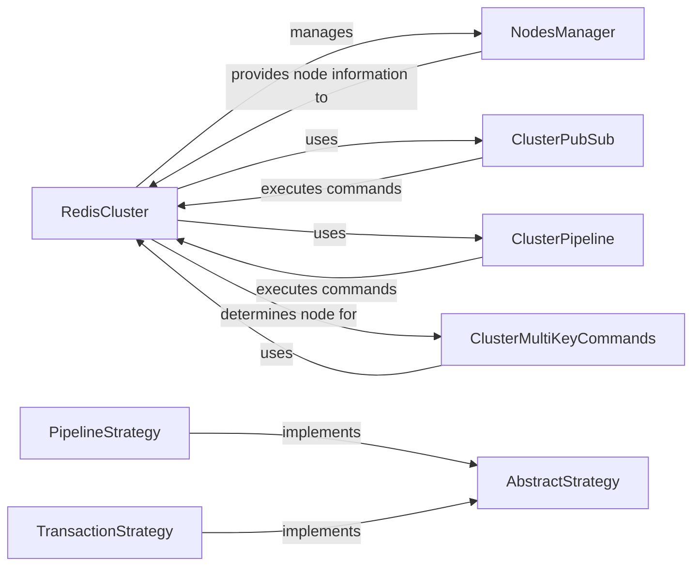

## Component Details

The Cluster Support component in redis-py provides the necessary tools for interacting with Redis clusters. It abstracts the complexities of cluster management, such as node discovery, slot assignment, and command routing, offering a unified interface for both synchronous and asynchronous operations. The core of this component lies in the `RedisCluster` class, which acts as the primary client. It leverages the `NodesManager` to maintain an updated view of the cluster topology and uses strategies like `PipelineStrategy` and `TransactionStrategy` to optimize command execution. The component also includes specialized classes for pub/sub (`ClusterPubSub`) and multi-key commands (`ClusterMultiKeyCommands`), ensuring comprehensive cluster functionality.

### RedisCluster
The RedisCluster class serves as the primary client interface for interacting with a Redis cluster. It handles connection management, command execution, and slot assignment to nodes in the cluster. It uses the NodesManager to maintain an up-to-date view of the cluster topology and routes commands to the appropriate nodes based on the key's slot. It supports both synchronous and asynchronous operations.
- **Related Classes/Methods**: `redis.cluster.RedisCluster` (456:1360), `redis.asyncio.cluster.RedisCluster` (99:989)

### NodesManager
The NodesManager class is responsible for managing the cluster's node topology. It maintains a list of all nodes in the cluster, their roles (primary or replica), and the slot ranges they serve. It dynamically updates the topology when nodes are added or removed, ensuring that the RedisCluster always has an accurate view of the cluster's structure.
- **Related Classes/Methods**: `redis.cluster.NodesManager` (1443:1863), `redis.asyncio.cluster.NodesManager` (1211:1518)

### ClusterPubSub
The ClusterPubSub class provides a client interface for interacting with Redis cluster's pub/sub functionality. It handles subscribing to channels and publishing messages to channels across the cluster, ensuring that messages are correctly routed to the appropriate nodes.
- **Related Classes/Methods**: `redis.cluster.ClusterPubSub` (1866:2107)

### ClusterPipeline
The ClusterPipeline class enables the execution of a batch of commands in a pipeline on a Redis cluster. It efficiently routes commands to the correct nodes and executes them in parallel, reducing network overhead and improving performance. It supports both synchronous and asynchronous operations.
- **Related Classes/Methods**: `redis.cluster.ClusterPipeline` (2110:2299), `redis.asyncio.cluster.ClusterPipeline` (1521:1680)

### PipelineStrategy
The PipelineStrategy class implements the AbstractStrategy interface for executing commands in a Redis cluster pipeline. It handles routing commands to the correct nodes and executing them in parallel, optimizing performance for pipelined operations.
- **Related Classes/Methods**: `redis.cluster.PipelineStrategy` (2671:3018), `redis.asyncio.cluster.PipelineStrategy` (1872:2039)

### TransactionStrategy
The TransactionStrategy class implements the AbstractStrategy interface for executing commands in a Redis cluster transaction. It ensures that all commands within the transaction are executed atomically, providing data consistency and reliability.
- **Related Classes/Methods**: `redis.cluster.TransactionStrategy` (3021:3352), `redis.asyncio.cluster.TransactionStrategy` (2042:2398)

### ClusterMultiKeyCommands
The ClusterMultiKeyCommands class provides methods for executing multi-key commands on a Redis cluster. It handles partitioning keys by slot and routing commands to the correct nodes, ensuring that multi-key operations are performed efficiently across the cluster.
- **Related Classes/Methods**: `redis.commands.cluster.ClusterMultiKeyCommands` (99:260), `redis.commands.cluster.AsyncClusterMultiKeyCommands` (263:339)