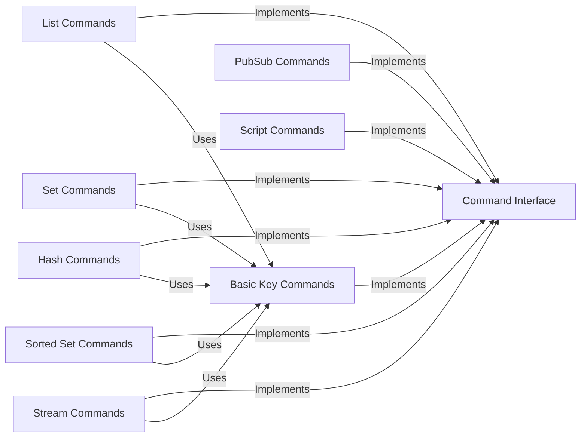

## Component Details

The Command Abstraction component provides a unified interface for interacting with Redis, abstracting away the complexities of command encoding, decoding, and execution. It encompasses various command categories, including keys, hashes, lists, sets, sorted sets, streams, pubsub, scripts, geo, modules, and functions, offering both synchronous and asynchronous execution modes. This abstraction ensures a consistent API for developers, regardless of the underlying Redis connection type, and simplifies the process of interacting with the Redis server.

### Command Interface
Defines the base interface for all Redis commands, providing a consistent way to execute commands and handle responses. It serves as a blueprint for concrete command implementations.
- **Related Classes/Methods**: `redis.commands.core.CommandsInterface` (20:100)

### Basic Key Commands
Implements basic key-related commands such as GET, SET, EXISTS, and DELETE. It interacts with the Redis client to execute these commands and provides methods for encoding and decoding key values.
- **Related Classes/Methods**: `redis.commands.core.BasicKeyCommands` (1557:2510)

### Hash Commands
Implements commands for interacting with Redis hashes, including setting, getting, and deleting fields. It interacts with the Redis client to execute these commands and provides methods for encoding and decoding hash field values.
- **Related Classes/Methods**: `redis.commands.core.HashCommands` (4921:5598)

### List Commands
Implements commands for interacting with Redis lists, including pushing, popping, and trimming elements. It interacts with the Redis client to execute these commands and provides methods for encoding and decoding list element values.
- **Related Classes/Methods**: `redis.commands.core.ListCommands` (2533:2947)

### Set Commands
Implements commands for interacting with Redis sets, including adding, removing, and checking membership of elements. It interacts with the Redis client to execute these commands and provides methods for encoding and decoding set element values.
- **Related Classes/Methods**: `redis.commands.core.SetCommands` (3287:3462)

### Sorted Set Commands
Implements commands for interacting with Redis sorted sets, including adding, removing, and retrieving elements with scores. It interacts with the Redis client to execute these commands and provides methods for encoding and decoding sorted set element values.
- **Related Classes/Methods**: `redis.commands.core.SortedSetCommands` (4077:4870)

### Stream Commands
Implements commands for interacting with Redis streams, including adding messages, reading messages, and creating consumer groups. It interacts with the Redis client to execute these commands and provides methods for encoding and decoding stream message values.
- **Related Classes/Methods**: `redis.commands.core.StreamCommands` (3468:4071)

### PubSub Commands
Implements commands for interacting with Redis's Pub/Sub functionality, including publishing messages and subscribing to channels. It interacts with the Redis client to execute these commands and provides methods for encoding and decoding pubsub messages.
- **Related Classes/Methods**: `redis.commands.core.PubSubCommands` (5720:5784)

### Script Commands
Enables the execution of Lua scripts on the Redis server. It includes functionalities for evaluating, loading, and managing scripts, providing a way to extend Redis's capabilities with custom logic.
- **Related Classes/Methods**: `redis.commands.core.ScriptCommands` (5790:5928)