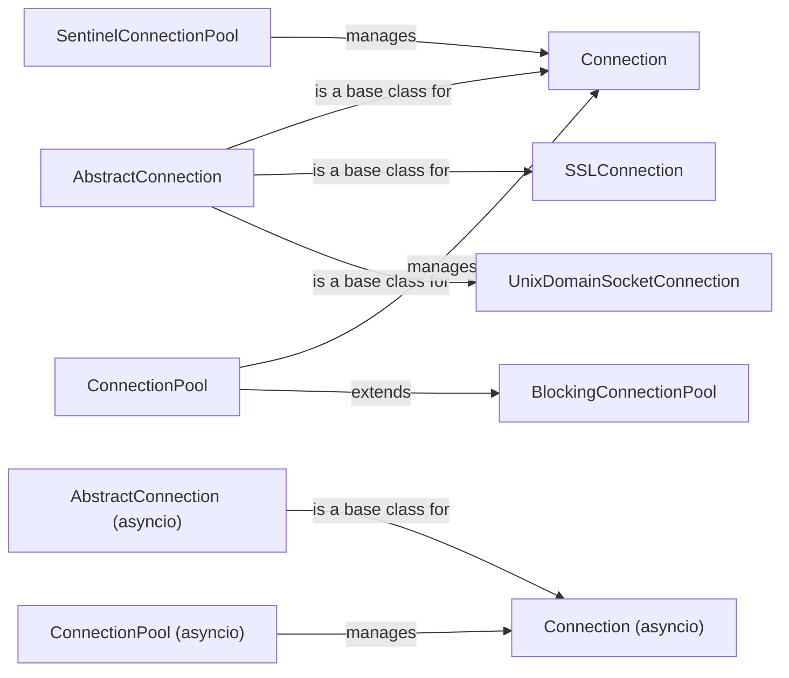

## Component Details

The Connection Management component in `redis` library is responsible for managing connections to Redis servers. It provides connection pooling, different connection types (TCP, SSL, Unix sockets), and connection management functionalities like authentication and health checks. The core of this component revolves around the `AbstractConnection` and its implementations, along with `ConnectionPool` which manages the connections. Sentinel-related classes handle connections in a Sentinel-managed Redis setup.

### AbstractConnection
AbstractConnection defines the base connection interface and implements common connection logic. It handles connection establishment, health checks, command sending, and response reading. It serves as a parent class for concrete connection implementations, providing a foundation for different connection types.
- **Related Classes/Methods**: `redis.connection.AbstractConnection:__init__` (228:322), `redis.connection.AbstractConnection:__repr__` (324:326), `redis.connection.AbstractConnection:__del__` (332:336), `redis.connection.AbstractConnection:_construct_command_packer` (338:344), `redis.connection.AbstractConnection:connect` (377:379), `redis.connection.AbstractConnection:connect_check_health` (381:413), `redis.connection.AbstractConnection:_error_message` (423:424), `redis.connection.AbstractConnection:on_connect` (426:427), `redis.connection.AbstractConnection:on_connect_check_health` (429:538), `redis.connection.AbstractConnection:_send_ping` (560:564), `redis.connection.AbstractConnection:_ping_failed` (566:568), `redis.connection.AbstractConnection:check_health` (570:573), `redis.connection.AbstractConnection:send_packed_command` (575:604), `redis.connection.AbstractConnection:send_command` (606:611), `redis.connection.AbstractConnection:can_read` (613:625), `redis.connection.AbstractConnection:read_response` (627:669), `redis.connection.AbstractConnection:re_auth` (719:727)

### Connection
Connection is a concrete implementation of AbstractConnection for standard TCP connections. It inherits connection management and command execution logic from AbstractConnection, providing a basic TCP socket connection to Redis.
- **Related Classes/Methods**: `redis.connection.Connection:__init__` (733:747)

### SSLConnection
SSLConnection extends Connection to provide SSL/TLS encryption for secure communication with Redis. It handles SSL context creation and socket wrapping, ensuring secure data transmission.
- **Related Classes/Methods**: `redis.connection.SSLConnection:__init__` (1024:1096), `redis.connection.SSLConnection:_connect` (1098:1107), `redis.connection.SSLConnection:_wrap_socket_with_ssl` (1109:1186)

### UnixDomainSocketConnection
UnixDomainSocketConnection extends Connection for communication over Unix domain sockets. It adapts the connection process to use socket files instead of TCP addresses, enabling local communication with Redis.
- **Related Classes/Methods**: `redis.connection.UnixDomainSocketConnection:__init__` (1192:1195)

### ConnectionPool
ConnectionPool manages a pool of connections to a Redis server. It handles connection creation, retrieval, and release, optimizing connection reuse and reducing connection overhead. It also manages the encoder to use for the connections, improving performance and resource utilization.
- **Related Classes/Methods**: `redis.connection.ConnectionPool:from_url` (1324:1370), `redis.connection.ConnectionPool:__init__` (1372:1433), `redis.connection.ConnectionPool:_checkpid` (1467:1512), `redis.connection.ConnectionPool:get_connection` (1519:1551), `redis.connection.ConnectionPool:get_encoder` (1553:1560), `redis.connection.ConnectionPool:make_connection` (1562:1573), `redis.connection.ConnectionPool:release` (1575:1597), `redis.connection.ConnectionPool:disconnect` (1602:1620), `redis.connection.ConnectionPool:close` (1622:1624), `redis.connection.ConnectionPool:re_auth_callback` (1633:1646)

### BlockingConnectionPool
BlockingConnectionPool extends ConnectionPool to provide blocking behavior when retrieving connections from the pool. It waits for a connection to become available if the pool is exhausted, ensuring that a connection is eventually obtained.
- **Related Classes/Methods**: `redis.connection.BlockingConnectionPool:__init__` (1691:1705), `redis.connection.BlockingConnectionPool:make_connection` (1731:1740), `redis.connection.BlockingConnectionPool:get_connection` (1747:1797), `redis.connection.BlockingConnectionPool:release` (1799:1818), `redis.connection.BlockingConnectionPool:disconnect` (1820:1824)

### AbstractConnection (asyncio)
AbstractConnection (asyncio) defines the base connection interface and implements common connection logic for asynchronous connections. It handles connection establishment, health checks, command sending, and response reading in an asynchronous manner.
- **Related Classes/Methods**: `redis.asyncio.connection.AbstractConnection:__init__` (138:225), `redis.asyncio.connection.AbstractConnection:__del__` (227:241), `redis.asyncio.connection.AbstractConnection:__repr__` (251:253), `redis.asyncio.connection.AbstractConnection:connect` (294:296), `redis.asyncio.connection.AbstractConnection:connect_check_health` (298:338), `redis.asyncio.connection.AbstractConnection:_error_message` (348:349), `redis.asyncio.connection.AbstractConnection:on_connect` (354:356), `redis.asyncio.connection.AbstractConnection:on_connect_check_health` (358:464), `redis.asyncio.connection.AbstractConnection:disconnect` (466:487), `redis.asyncio.connection.AbstractConnection:_send_ping` (489:493), `redis.asyncio.connection.AbstractConnection:_ping_failed` (495:497), `redis.asyncio.connection.AbstractConnection:send_packed_command` (511:550), `redis.asyncio.connection.AbstractConnection:send_command` (552:556), `redis.asyncio.connection.AbstractConnection:can_read_destructive` (558:565), `redis.asyncio.connection.AbstractConnection:read_response` (567:623), `redis.asyncio.connection.AbstractConnection:pack_commands` (671:699), `redis.asyncio.connection.AbstractConnection:process_invalidation_messages` (705:707), `redis.asyncio.connection.AbstractConnection:re_auth` (712:720)

### Connection (asyncio)
Connection (asyncio) is a concrete implementation of AbstractConnection for standard TCP connections in an asynchronous context. It inherits connection management and command execution logic from AbstractConnection, providing an asynchronous TCP socket connection to Redis.
- **Related Classes/Methods**: `redis.asyncio.connection.Connection:__init__` (726:741), `redis.asyncio.connection.Connection:_connect` (752:774)

### ConnectionPool (asyncio)
ConnectionPool (asyncio) manages a pool of asynchronous connections to a Redis server. It handles connection creation, retrieval, and release, optimizing connection reuse and reducing connection overhead in asynchronous operations.
- **Related Classes/Methods**: `redis.asyncio.connection.ConnectionPool:from_url` (1046:1090), `redis.asyncio.connection.ConnectionPool:__init__` (1092:1112), `redis.asyncio.connection.ConnectionPool:get_connection` (1138:1148), `redis.asyncio.connection.ConnectionPool:get_available_connection` (1150:1159), `redis.asyncio.connection.ConnectionPool:make_connection` (1170:1172), `redis.asyncio.connection.ConnectionPool:ensure_connection` (1174:1188), `redis.asyncio.connection.ConnectionPool:release` (1190:1198), `redis.asyncio.connection.ConnectionPool:aclose` (1222:1224), `redis.asyncio.connection.ConnectionPool:re_auth_callback` (1232:1245)

### SentinelConnectionPool
SentinelConnectionPool manages a pool of connections to Redis servers monitored by Sentinel. It handles connection discovery, failover, and role management based on Sentinel's information, ensuring high availability and fault tolerance.
- **Related Classes/Methods**: `redis.sentinel.SentinelConnectionPool:__init__` (145:166), `redis.sentinel.SentinelConnectionPool:reset` (175:177), `redis.sentinel.SentinelConnectionPool:owns_connection` (183:188), `redis.sentinel.SentinelConnectionPool:get_master_address` (190:191), `redis.sentinel.SentinelConnectionPool:rotate_slaves` (193:195)