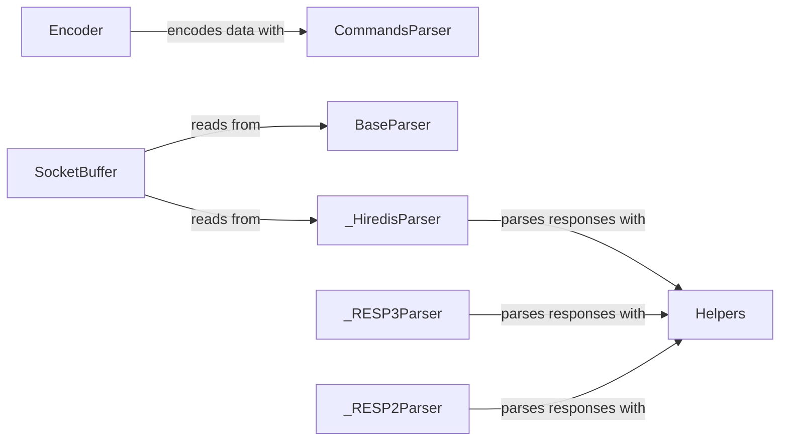

## Component Details

The Data Handling component is responsible for managing the serialization of commands and parsing of responses between the client and the Redis server. It encompasses encoding outgoing commands into the Redis Serialization Protocol (RESP) format and decoding incoming responses back into Python data types. This involves handling different RESP versions (RESP2, RESP3) and utilizing helper functions for parsing specific data structures. The component ensures data integrity and compatibility during communication with the Redis server.

### Encoder
The Encoder class handles the serialization of Python data into the Redis Serialization Protocol (RESP) format. It provides methods for encoding various data types, ensuring they are properly formatted for transmission to the Redis server. It interacts with the CommandsParser to encode commands before sending them to Redis.
- **Related Classes/Methods**: `redis._parsers.encoders.Encoder:encode` (14:35)

### CommandsParser
The CommandsParser class is responsible for parsing commands and extracting keys from them. It is initialized with command flags and provides methods for retrieving keys based on the command being parsed. It interacts with the Encoder to prepare commands for encoding and transmission.
- **Related Classes/Methods**: `redis._parsers.commands.AbstractCommandsParser:_get_pubsub_keys` (11:38), `redis._parsers.commands.AbstractCommandsParser:parse_subcommand` (40:53), `redis._parsers.commands.CommandsParser:__init__` (65:67), `redis._parsers.commands.CommandsParser:get_keys` (82:145), `redis._parsers.asyncio.commands.AsyncCommandsParser:get_keys` (full file reference)

### BaseParser
The BaseParser class serves as the base class for all parsers (RESP2, RESP3, Hiredis). It provides common functionality and defines the interface for parsing responses. It includes methods for handling errors and managing the connection. It interacts with the SocketBuffer to read data and with the Helpers module to parse specific data types.
- **Related Classes/Methods**: `redis._parsers.base.BaseParser:parse_error` (90:99), `redis._parsers.base._RESPBase:__del__` (117:121), `redis._parsers.base._RESPBase:on_connect` (123:129), `redis._parsers.base._RESPBase:can_read` (139:140), `redis._parsers.base._AsyncRESPBase:__init__` (218:223), `redis._parsers.base._AsyncRESPBase:on_connect` (229:236), `redis._parsers.base._AsyncRESPBase:can_read_destructive` (242:251), `redis._parsers.base._AsyncRESPBase:_read` (253:271), `redis._parsers.base._AsyncRESPBase:_readline` (273:289)

### _RESP2Parser
The _RESP2Parser class is responsible for parsing RESP2 responses. It provides methods for reading and parsing responses according to the RESP2 protocol. It handles the parsing of data structures defined in RESP2. It inherits from BaseParser and uses the Helpers module for parsing specific data types.
- **Related Classes/Methods**: `redis._parsers.resp2._RESP2Parser:read_response` (12:22), `redis._parsers.resp2._RESP2Parser:_read_response` (24:68), `redis._parsers.resp2._AsyncRESP2Parser:read_response` (74:85), `redis._parsers.resp2._AsyncRESP2Parser:_read_response` (87:132)

### _RESP3Parser
The _RESP3Parser class is responsible for parsing RESP3 responses. It provides methods for reading and parsing responses according to the RESP3 protocol. It handles the complexities of the RESP3 protocol, including different data types and structures. It inherits from BaseParser and uses the Helpers module for parsing specific data types.
- **Related Classes/Methods**: `redis._parsers.resp3._RESP3Parser:__init__` (18:21), `redis._parsers.resp3._RESP3Parser:read_response` (28:40), `redis._parsers.resp3._RESP3Parser:_read_response` (42:131), `redis._parsers.resp3._AsyncRESP3Parser:__init__` (135:138), `redis._parsers.resp3._AsyncRESP3Parser:read_response` (145:158), `redis._parsers.resp3._AsyncRESP3Parser:_read_response` (160:257)

### _HiredisParser
The _HiredisParser class is a parser that uses the hiredis library for parsing RESP (Redis Serialization Protocol) responses. It provides methods for reading data from the socket and parsing the response. It leverages the speed and efficiency of the hiredis library for faster parsing. It inherits from BaseParser and uses the Helpers module for parsing specific data types.
- **Related Classes/Methods**: `redis._parsers.hiredis._HiredisParser:__init__` (44:51), `redis._parsers.hiredis._HiredisParser:__del__` (53:57), `redis._parsers.hiredis._HiredisParser:can_read` (92:100), `redis._parsers.hiredis._HiredisParser:read_from_socket` (102:130), `redis._parsers.hiredis._HiredisParser:read_response` (132:184), `redis._parsers.hiredis._AsyncHiredisParser:__init__` (192:199), `redis._parsers.hiredis._AsyncHiredisParser:can_read_destructive` (233:242), `redis._parsers.hiredis._AsyncHiredisParser:read_from_socket` (244:251), `redis._parsers.hiredis._AsyncHiredisParser:read_response` (253:295)

### SocketBuffer
The SocketBuffer class manages reading data from a socket. It provides methods for reading lines, reading a specific number of bytes, checking if data is available, and purging the buffer. It acts as an intermediary between the raw socket and the parsers, providing a buffered interface for reading data. It is used by the parsers (RESP2, RESP3, Hiredis) to read data from the socket.
- **Related Classes/Methods**: `redis._parsers.socket.SocketBuffer:_read_from_socket` (47:92), `redis._parsers.socket.SocketBuffer:can_read` (94:97), `redis._parsers.socket.SocketBuffer:read` (99:108), `redis._parsers.socket.SocketBuffer:readline` (110:118), `redis._parsers.socket.SocketBuffer:purge` (132:149)

### Helpers
The Helpers module contains a collection of helper functions for parsing various Redis responses. These functions are used to extract specific data from the responses and convert them into Python data types. They provide specialized parsing logic for different Redis commands and data structures. It is used by the parsers (RESP2, RESP3, Hiredis) to parse specific data types.
- **Related Classes/Methods**: `redis._parsers.helpers:parse_debug_object` (17:32), `redis._parsers.helpers:parse_info` (35:83), `redis._parsers.helpers:parse_memory_stats` (86:94), `redis._parsers.helpers:parse_sentinel_state` (124:137), `redis._parsers.helpers:parse_sentinel_master` (140:141), `redis._parsers.helpers:parse_sentinel_state_resp3` (144:154), `redis._parsers.helpers:parse_sentinel_masters` (157:162), `redis._parsers.helpers:parse_sentinel_masters_resp3` (165:166), `redis._parsers.helpers:parse_sentinel_slaves_and_sentinels` (169:170), `redis._parsers.helpers:parse_sentinel_slaves_and_sentinels_resp3` (173:174), `redis._parsers.helpers:parse_stream_list` (238:247), `redis._parsers.helpers:pairs_to_dict_with_str_keys` (250:251), `redis._parsers.helpers:parse_xclaim` (258:261), `redis._parsers.helpers:parse_xautoclaim` (264:268), `redis._parsers.helpers:parse_xinfo_stream` (271:299), `redis._parsers.helpers:parse_xread` (302:305), `redis._parsers.helpers:parse_xread_resp3` (308:311), `redis._parsers.helpers:parse_xpending` (314:323), `redis._parsers.helpers:bool_ok` (337:338), `redis._parsers.helpers:parse_client_list` (349:354), `redis._parsers.helpers:parse_config_get` (357:359), `redis._parsers.helpers:parse_hscan` (367:374), `redis._parsers.helpers:parse_slowlog_get` (389:415), `redis._parsers.helpers:parse_stralgo` (418:444), `redis._parsers.helpers:parse_cluster_info` (447:449), `redis._parsers.helpers:_parse_node_line` (452:472), `redis._parsers.helpers:parse_cluster_nodes` (495:502), `redis._parsers.helpers:parse_command` (541:557), `redis._parsers.helpers:parse_command_resp3` (560:578), `redis._parsers.helpers:parse_client_kill` (585:588), `redis._parsers.helpers:parse_acl_getuser` (591:631), `redis._parsers.helpers:parse_acl_log` (634:649), `redis._parsers.helpers:parse_client_info` (652:680), `redis._parsers.helpers:parse_config_get` (357:359), `redis._parsers.helpers:parse_client_info` (652:680), `redis._parsers.helpers:parse_set_result` (683:694)