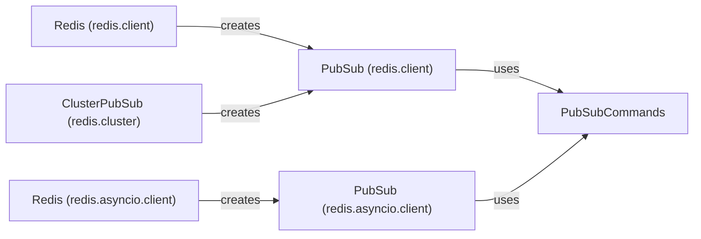

## Component Details

The PubSub Management component in Redis provides publish/subscribe functionalities for real-time messaging. Clients can subscribe to channels and receive messages published to those channels. It supports both synchronous and asynchronous pub/sub operations, managing subscriptions and efficiently distributing messages to subscribers. The core components include the synchronous and asynchronous PubSub classes, the Redis client classes that provide access to PubSub instances, the ClusterPubSub class for cluster environments, and the PubSubCommands class that defines the core pubsub commands.

### PubSub (redis.client)
The PubSub class in redis.client provides a synchronous interface for subscribing to channels and listening for messages. It manages connection details, command execution, message parsing, and thread management for asynchronous message handling within a thread.
- **Related Classes/Methods**: `redis.client.PubSub` (743:1241), `redis.client.PubSub.__init__` (756:791), `redis.client.PubSub.__exit__` (796:797), `redis.client.PubSub.__del__` (799:806), `redis.client.PubSub:close` (823:824), `redis.client.PubSub:on_connect` (826:849), `redis.client.PubSub:execute_command` (856:880), `redis.client.PubSub:_execute` (910:921), `redis.client.PubSub:parse_response` (923:948), `redis.client.PubSub:psubscribe` (983:1007), `redis.client.PubSub:punsubscribe` (1009:1020), `redis.client.PubSub:subscribe` (1022:1046), `redis.client.PubSub:unsubscribe` (1048:1059), `redis.client.PubSub:ssubscribe` (1061:1085), `redis.client.PubSub:sunsubscribe` (1087:1098), `redis.client.PubSub:listen` (1100:1105), `redis.client.PubSub:get_message` (1107:1134), `redis.client.PubSub:ping` (1138:1143), `redis.client.PubSub:handle_message` (1145:1217), `redis.client.PubSub:run_in_thread` (1219:1241), `redis.client.PubSub:clean_health_check_responses` (882:898)

### PubSub (redis.asyncio.client)
The PubSub class in redis.asyncio.client provides an asynchronous interface for subscribing to channels and listening for messages. It manages connections, executes commands, parses responses, and handles asynchronous message processing using asyncio.
- **Related Classes/Methods**: `redis.asyncio.client.PubSub` (803:1231), `redis.asyncio.client.PubSub.__init__` (816:855), `redis.asyncio.client.PubSub.__aexit__` (860:861), `redis.asyncio.client.PubSub:close` (885:887), `redis.asyncio.client.PubSub:reset` (890:892), `redis.asyncio.client.PubSub:on_connect` (894:910), `redis.asyncio.client.PubSub:execute_command` (917:927), `redis.asyncio.client.PubSub:connect` (929:947), `redis.asyncio.client.PubSub:_execute` (956:967), `redis.asyncio.client.PubSub:parse_response` (969:995), `redis.asyncio.client.PubSub:psubscribe` (1023:1042), `redis.asyncio.client.PubSub:punsubscribe` (1044:1057), `redis.asyncio.client.PubSub:subscribe` (1059:1078), `redis.asyncio.client.PubSub:unsubscribe` (1080:1092), `redis.asyncio.client.PubSub:listen` (1094:1099), `redis.asyncio.client.PubSub:get_message` (1101:1114), `redis.asyncio.client.PubSub:ping` (1116:1121), `redis.asyncio.client.PubSub:handle_message` (1123:1187), `redis.asyncio.client.PubSub:run` (1189:1231)

### Redis (redis.client)
The Redis class in redis.client provides the base synchronous Redis client. It exposes the `pubsub` method, which returns a PubSub instance associated with that client, allowing clients to subscribe to channels and receive messages.
- **Related Classes/Methods**: `redis.client.Redis:pubsub` (556:564)

### Redis (redis.asyncio.client)
The Redis class in redis.asyncio.client provides the base asynchronous Redis client. It exposes the `pubsub` method, which returns a PubSub instance associated with that client, enabling asynchronous subscription to channels and message reception.
- **Related Classes/Methods**: `redis.asyncio.client.Redis:pubsub` (578:586)

### PubSubCommands
The PubSubCommands class in redis.commands.core provides the core pubsub commands such as publish, spublish, pubsub_channels, pubsub_numpat, pubsub_numsub, and pubsub_shardnumsub. These commands are used to publish messages to channels, retrieve information about active channels, and manage subscriptions.
- **Related Classes/Methods**: `redis.commands.core.PubSubCommands:publish` (5726:5733), `redis.commands.core.PubSubCommands:spublish` (5735:5742), `redis.commands.core.PubSubCommands:pubsub_channels` (5744:5750), `redis.commands.core.PubSubCommands:pubsub_shardchannels` (5752:5758), `redis.commands.core.PubSubCommands:pubsub_numpat` (5760:5766), `redis.commands.core.PubSubCommands:pubsub_numsub` (5768:5775), `redis.commands.core.PubSubCommands:pubsub_shardnumsub` (5777:5784)

### ClusterPubSub (redis.cluster)
The ClusterPubSub class in redis.cluster provides an interface for pubsub operations in a Redis Cluster environment. It handles sharded messages and manages connections to multiple nodes to ensure messages are correctly distributed across the cluster.
- **Related Classes/Methods**: `redis.cluster.RedisCluster:pubsub` (834:839), `redis.cluster.ClusterPubSub` (1866:2107), `redis.cluster.ClusterPubSub.__init__` (1875:1918), `redis.cluster.ClusterPubSub:set_pubsub_node` (1920:1951), `redis.cluster.ClusterPubSub:_raise_on_invalid_node` (1959:1967), `redis.cluster.ClusterPubSub:execute_command` (1969:2009), `redis.cluster.ClusterPubSub:get_sharded_message` (2033:2057), `redis.cluster.ClusterPubSub:ssubscribe` (2059:2077), `redis.cluster.ClusterPubSub:sunsubscribe` (2079:2091)