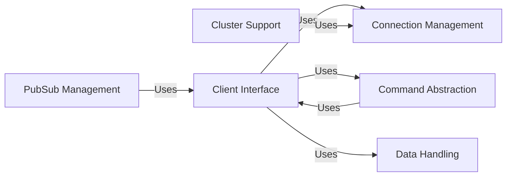

## Component Details

The redis-py library provides a Python interface for interacting with Redis, a popular in-memory data structure store. The library abstracts the complexities of the Redis protocol, offering a user-friendly API for performing various operations, including data manipulation, pub/sub, and cluster management. It supports both synchronous and asynchronous operations, catering to a wide range of application requirements. The library is designed to be efficient and reliable, providing robust connection management and error handling.

### Client Interface
The Client Interface serves as the primary entry point for interacting with Redis. It encapsulates connection management, command execution, and response handling. Supporting both synchronous and asynchronous operations, it can be configured to connect to a single Redis instance or a Redis cluster. This component handles the core functionality of sending commands to the Redis server and receiving responses, providing a high-level API for users.
- **Related Classes/Methods**: `redis.client.Redis` (112:670), `redis.asyncio.client.Redis` (109:715)

### Command Abstraction
The Command Abstraction offers a high-level interface for executing Redis commands, encompassing implementations for various command categories like keys, hashes, lists, sets, and sorted sets. It supports both synchronous and asynchronous execution, providing a consistent API for interacting with Redis regardless of the underlying connection type. This component also manages command encoding and decoding, ensuring seamless communication with the Redis server.
- **Related Classes/Methods**: `redis.commands.core.BasicKeyCommands` (1557:2510), `redis.commands.core.HashCommands` (4921:5598), `redis.commands.core.ListCommands` (2533:2947), `redis.commands.core.SetCommands` (3287:3462), `redis.commands.core.SortedSetCommands` (4077:4870), `redis.commands.core.StreamCommands` (3468:4071), `redis.commands.core.PubSubCommands` (5720:5784), `redis.commands.core.AsyncBasicKeyCommands` (2513:2530)

### Connection Management
The Connection Management component is responsible for establishing and maintaining connections to the Redis server. It provides connection pooling, socket management, and authentication functionalities. Supporting various connection types, including TCP, SSL, and Unix domain sockets, it also implements retry mechanisms for handling connection errors. This component ensures reliable and efficient communication with the Redis server.
- **Related Classes/Methods**: `redis.connection.ConnectionPool` (1309:1654), `redis.asyncio.connection.ConnectionPool` (1031:1253), `redis.connection.Connection` (730:801), `redis.asyncio.connection.Connection` (723:777)

### Cluster Support
The Cluster Support component provides functionalities for managing and interacting with Redis clusters, handling node discovery, slot assignment, and command routing. It supports both synchronous and asynchronous cluster operations, offering a consistent API for interacting with Redis clusters. This component is responsible for distributing commands across the cluster and handling failover scenarios, ensuring high availability and scalability.
- **Related Classes/Methods**: `redis.cluster.RedisCluster` (456:1360), `redis.asyncio.cluster.RedisCluster` (99:989), `redis.cluster.NodesManager` (1443:1863), `redis.asyncio.cluster.NodesManager` (1211:1518)

### PubSub Management
The PubSub Management component provides publish/subscribe functionalities for real-time messaging, enabling clients to subscribe to channels and receive messages published to those channels. It supports both synchronous and asynchronous pub/sub operations, managing subscriptions and distributing messages to subscribers efficiently. This component facilitates real-time communication and event-driven architectures.
- **Related Classes/Methods**: `redis.client.PubSub` (743:1241), `redis.asyncio.client.PubSub` (803:1231), `redis.cluster.ClusterPubSub` (1866:2107)

### Data Handling
The Data Handling component manages the serialization of commands and parsing of responses between the client and the Redis server. It supports different serialization formats, including RESP2 and RESP3, and includes helper functions for parsing specific data types. This component ensures that data is correctly formatted for transmission to and from the Redis server, maintaining data integrity and compatibility.
- **Related Classes/Methods**: `redis._parsers.encoders.Encoder` (4:44), `redis._parsers.commands.CommandsParser` (56:170), `redis._parsers.commands.AsyncCommandsParser` (173:281), `redis._parsers.helpers` (full file reference)