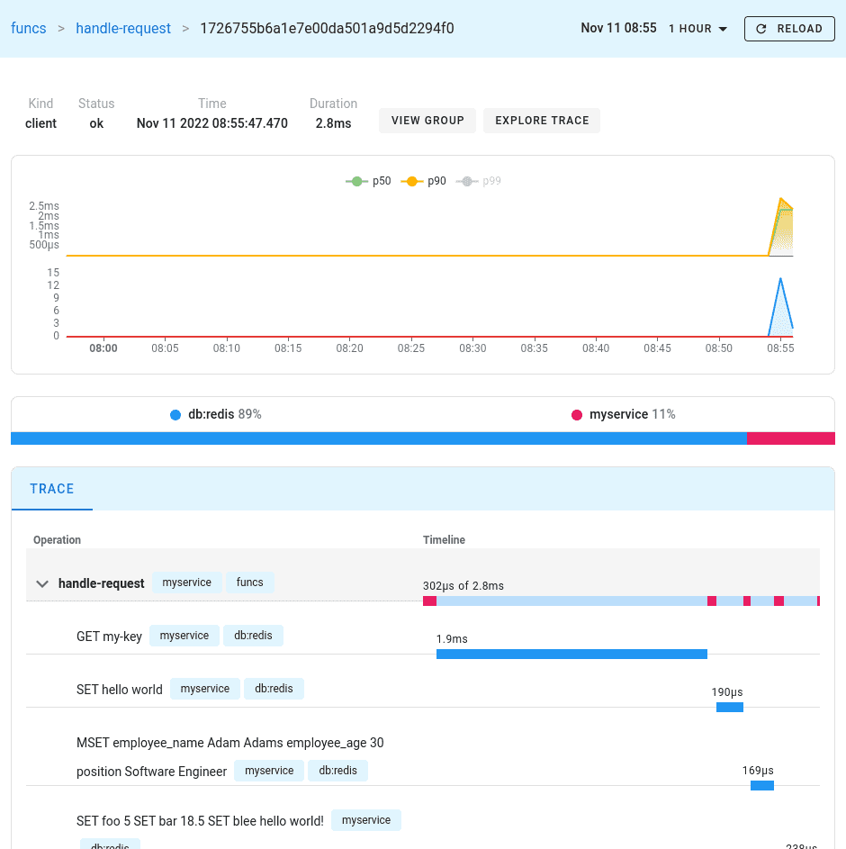

# Example for redis-py OpenTelemetry instrumentation

This example demonstrates how to monitor Redis using [OpenTelemetry](https://opentelemetry.io/) and
[Uptrace](https://github.com/uptrace/uptrace). It requires Docker to start Redis Server and Uptrace.

See
[Monitoring redis-py performance with OpenTelemetry](https://redis-py.readthedocs.io/en/latest/opentelemetry.html)
for details.

**Step 1**. Download the example using Git:

```shell
git clone https://github.com/redis/redis-py.git
cd example/opentelemetry
```

**Step 2**. Optionally, create a virtualenv:

```shell
python3 -m venv .venv
source .venv/bin/active
```

**Step 3**. Install dependencies:

```shell
pip install -r requirements.txt
```

**Step 4**. Start the services using Docker and make sure Uptrace is running:

```shell
docker-compose up -d
docker-compose logs uptrace
```

**Step 5**. Run the Redis client example and follow the link from the CLI to view the trace:

```shell
python3 main.py
trace: http://localhost:14318/traces/ee029d8782242c8ed38b16d961093b35
```



You can also open Uptrace UI at [http://localhost:14318](http://localhost:14318) to view available
spans, logs, and metrics.
