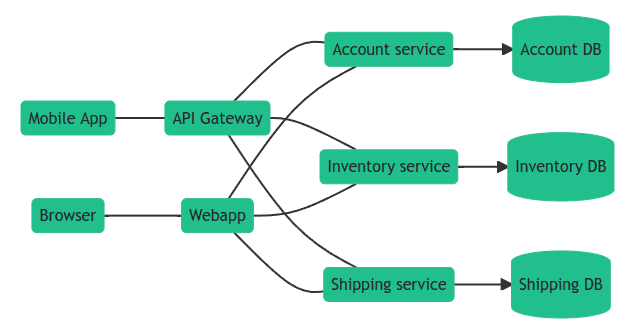
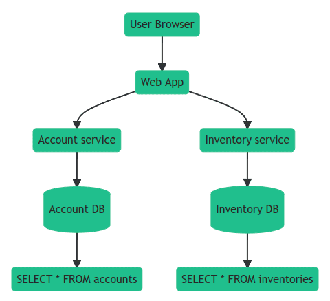
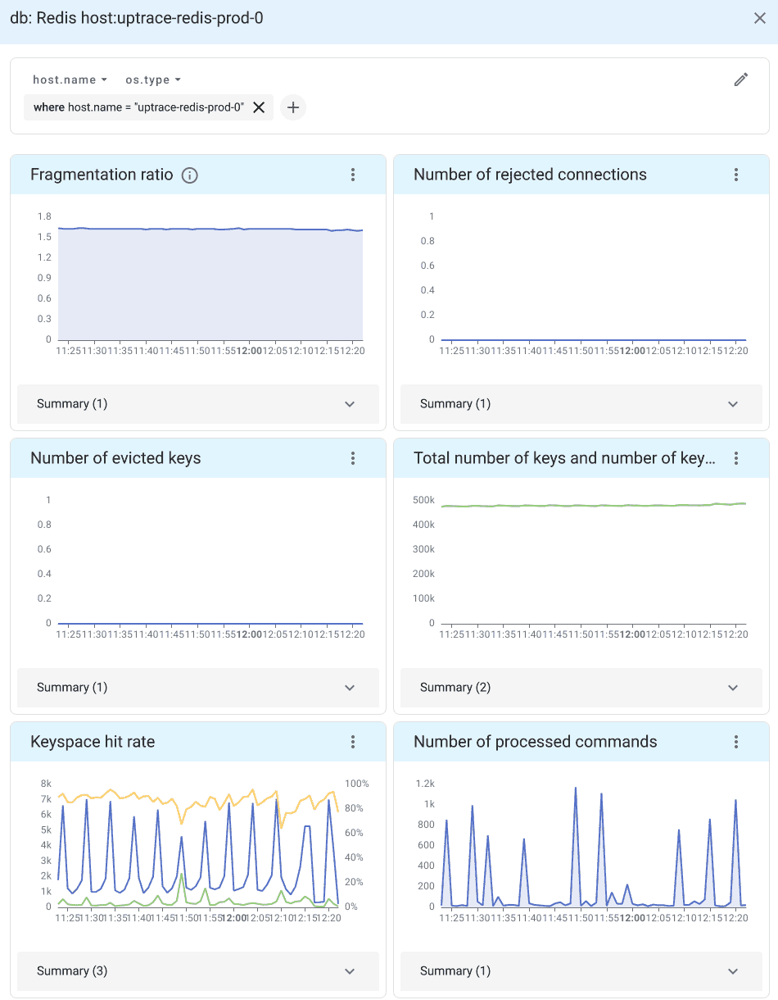

Integrating OpenTelemetry
=========================

What is OpenTelemetry?
----------------------

`OpenTelemetry <https://opentelemetry.io>`_ is an open-source observability framework for traces, metrics, and logs. It is a merger of OpenCensus and OpenTracing projects hosted by Cloud Native Computing Foundation.

OpenTelemetry allows developers to collect and export telemetry data in a vendor agnostic way. With OpenTelemetry, you can instrument your application once and then add or change vendors without changing the instrumentation, for example, here is a list of `popular DataDog competitors <https://uptrace.dev/get/compare/datadog-competitors.html>`_ that support OpenTelemetry.

What is tracing?
----------------

`OpenTelemetry tracing <https://uptrace.dev/opentelemetry/distributed-tracing.html>`_ allows you to see how a request progresses through different services and systems, timings of each operation, any logs and errors as they occur.

In a distributed environment, tracing also helps you understand relationships and interactions between microservices. Distributed tracing gives an insight into how a particular microservice is performing and how that service affects other microservices.

Using tracing, you can break down requests into spans. **Span** is an operation (unit of work) your app performs handling a request, for example, a database query or a network call.

**Trace** is a tree of spans that shows the path that a request makes through an app. Root span is the first span in a trace.

To learn more about tracing, see `Distributed Tracing using OpenTelemetry <https://uptrace.dev/opentelemetry/distributed-tracing.html>`_.

OpenTelemetry instrumentation
-----------------------------

Instrumentations are plugins for popular frameworks and libraries that use OpenTelemetry API to record important operations, for example, HTTP requests, DB queries, logs, errors, and more.

To install OpenTelemetry `instrumentation <https://opentelemetry-python-contrib.readthedocs.io/en/latest/instrumentation/redis/redis.html>`_ for redis-py:

.. code-block:: shell

   pip install opentelemetry-instrumentation-redis

You can then use it to instrument code like this:

.. code-block:: python

   from opentelemetry.instrumentation.redis import RedisInstrumentor

   RedisInstrumentor().instrument()

Once the code is patched, you can use redis-py as usually:

.. code-block:: python

   # Sync client
   client = redis.Redis()
   client.get("my-key")

   # Async client
   client = redis.asyncio.Redis()
   await client.get("my-key")

OpenTelemetry API
-----------------

`OpenTelemetry <https://uptrace.dev/opentelemetry/>`_ API is a programming interface that you can use to instrument code and collect telemetry data such as traces, metrics, and logs.

You can use OpenTelemetry API to measure important operations:

.. code-block:: python

   from opentelemetry import trace

   tracer = trace.get_tracer("app_or_package_name", "1.0.0")

   # Create a span with name "operation-name" and kind="server".
   with tracer.start_as_current_span("operation-name", kind=trace.SpanKind.CLIENT) as span:
       do_some_work()

Record contextual information using attributes:

.. code-block:: python

   if span.is_recording():
       span.set_attribute("http.method", "GET")
       span.set_attribute("http.route", "/projects/:id")

And monitor exceptions:

.. code-block:: python

   except ValueError as exc:
       # Record the exception and update the span status.
       span.record_exception(exc)
       span.set_status(trace.Status(trace.StatusCode.ERROR, str(exc)))

See `OpenTelemetry Python Tracing API <https://uptrace.dev/opentelemetry/python-tracing.html>`_ for details.

Uptrace
-------

Uptrace is an `open source APM <https://uptrace.dev/get/open-source-apm.html>`_ that supports distributed tracing, metrics, and logs. You can use it to monitor applications and set up automatic alerts to receive notifications via email, Slack, Telegram, and more.

You can use Uptrace to monitor redis-py using this `GitHub example <https://github.com/redis/redis-py/tree/master/docs/examples/opentelemetry>`_ as a starting point.

.. image:: images/opentelemetry/redis-py-trace.png
  :alt: Redis-py trace

You can `install Uptrace <https://uptrace.dev/get/install.html>`_ by downloading a DEB/RPM package or a pre-compiled binary.

Monitoring Redis Server performance
-----------------------------------

In addition to monitoring redis-py client, you can also monitor Redis Server performance using OpenTelemetry Collector Agent.

OpenTelemetry Collector is a proxy/middleman between your application and a `distributed tracing tool <https://uptrace.dev/blog/distributed-tracing-tools.html>`_ such as Uptrace or Jaeger. Collector receives telemetry data, processes it, and then exports the data to APM tools that can store it permanently.

For example, you can use the `OpenTelemetry Redis receiver <https://uptrace.dev/get/monitor/opentelemetry-redis.html>` provided by Otel Collector to monitor Redis performance:

See introduction to `OpenTelemetry Collector <https://uptrace.dev/opentelemetry/collector.html>`_ for details.

Alerting and notifications
--------------------------

Uptrace also allows you to monitor `OpenTelemetry metrics <https://uptrace.dev/opentelemetry/metrics.html>`_ using alerting rules. For example, the following monitor uses the group by node expression to create an alert whenever an individual Redis shard is down:

.. code-block:: python

   monitors:
     - name: Redis shard is down
       metrics:
         - redis_up as $redis_up
       query:
         - group by cluster # monitor each cluster,
         - group by bdb # each database,
         - group by node # and each shard
         - $redis_up
       min_allowed_value: 1
       # shard should be down for 5 minutes to trigger an alert
       for_duration: 5m

You can also create queries with more complex expressions. For example, the following rule creates an alert when the keyspace hit rate is lower than 75%:

.. code-block:: python

   monitors:
     - name: Redis read hit rate < 75%
       metrics:
         - redis_keyspace_read_hits as $hits
         - redis_keyspace_read_misses as $misses
       query:
         - group by cluster
         - group by bdb
         - group by node
         - $hits / ($hits + $misses) as hit_rate
       min_allowed_value: 0.75
       for_duration: 5m

See `Alerting and Notifications <https://uptrace.dev/get/alerting.html>`_ for details.

What's next?
------------

Next, you can learn how to configure `uptrace-python <https://uptrace.dev/get/opentelemetry-python.html>`_ to export spans, metrics, and logs to Uptrace.

You may also be interested in the following guides:

- `OpenTelemetry Django <https://uptrace.dev/get/instrument/opentelemetry-django.html>`_
- `OpenTelemetry Flask <https://uptrace.dev/get/instrument/instrument/opentelemetry-flask.html>`_
- `OpenTelemetry FastAPI <https://uptrace.dev/get/instrument/opentelemetry-fastapi.html>`_
- `OpenTelemetry SQLAlchemy <https://uptrace.dev/get/instrument/opentelemetry-sqlalchemy.html>`_
